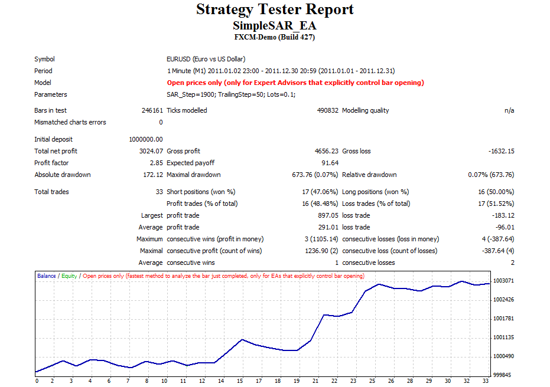
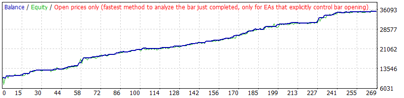
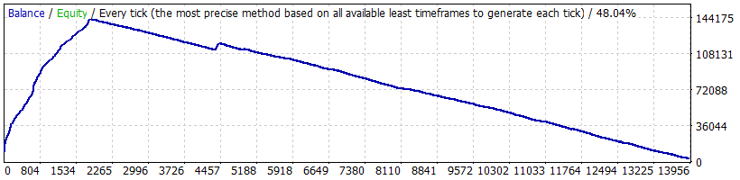

# Simple Stop&Reverse expert advisor

> Source: https://fxcodebase.com/code/viewtopic.php?f=38&t=19950  
> Forum: 38 · Topic 19950 · 17 post(s)

---

## Simple Stop&Reverse expert advisor

**Alexander.Gettinger** · Tue Jun 05, 2012 3:33 pm

At the beginning the EA creates two pending orders:
1. BUYSTOP with the open price (Ask+SAR_Step/2) and stop level (Bid-SAR_Step/2)
2. SELLSTOP with the open price (Bid-SAR_Step/2) and stop level (Ask+SAR_Step/2).

After the opening of any order EA trailing its stop level with the pending order.

 

Download:

 [SimpleSAR_EA.mq4](files/35129/SimpleSAR_EA.mq4)

TS2/Lua version.
[viewtopic.php?f=31&t=69115](https://fxcodebase.com/code/viewtopic.php?f=31&t=69115)

---

## Re: Simple Stop&Reverse expert advisor

**fwcolbert** · Tue Feb 02, 2016 1:42 am

Hello Can this strategy have Maximum Open trades of 1?

---

## Re: Simple Stop&Reverse expert advisor

**Apprentice** · Thu Feb 04, 2016 2:06 am

Your request is added to the development list.

---

## Re: Simple Stop&Reverse expert advisor

**Alexander.Gettinger** · Thu Feb 14, 2019 10:19 pm

Please try this strategy:

 [SimpleSAR_EA2.mq4](files/123921/SimpleSAR_EA2.mq4)

---

## Re: Simple Stop&Reverse expert advisor

**TheGMan** · Sun Feb 17, 2019 5:22 pm

Impressive! G/U D1 Default

---

## Re: Simple Stop&Reverse expert advisor

**Crysita** · Sat Oct 19, 2019 11:30 am

Hello!

Would be possible to add to this EA: Trailing_Setp > FreezeLevel
where FreezeLevel =MarketInfo(Symbol(),MODE_FREEZELEVEL) ?

Thank you!

---

## Re: Simple Stop&Reverse expert advisor

**rod777** · Sat Oct 26, 2019 3:29 pm

[https://drive.google.com/drive/folders/ ... iRcedt1vey](https://drive.google.com/drive/folders/1rgLnSaVfE1_Rhl4gJMa2zaiRcedt1vey)

---

## Re: Simple Stop&Reverse expert advisor

**Apprentice** · Tue Oct 29, 2019 6:26 am

Your request is added to the development list.
Development reference 256.

---

## Re: Simple Stop&Reverse expert advisor

**Apprentice** · Thu Oct 31, 2019 6:35 am

don't understand what needs to be done.
If Trailing_Setp > FreezeLevel then what?
if not Trailing_Setp > FreezeLevel then what?

---

## Re: Simple Stop&Reverse expert advisor

**Crysita** · Sat Nov 02, 2019 1:19 pm

Hi Apprendice!

Sorry I was not clear!

Once it is found out the FreezeLevel the Trailing step would be set to be this value plus some pips:

Trailing_Step=FreezeLevel+ NumPips (that could be an input)

otherwise do not trade.

I hope this clarify the request.

Thank you!

---

## Re: Simple Stop&Reverse expert advisor

**Apprentice** · Wed Nov 06, 2019 9:20 am

[SimpleSAR_EA2.mq4](files/129605/SimpleSAR_EA2.mq4)

Try this version.

---

## Re: Simple Stop&Reverse expert advisor

**Crysita** · Wed Nov 06, 2019 11:32 am

Hello Apprentice!
Thank you very much!

---

## Re: Simple Stop&Reverse expert advisor

**Steve0001** · Wed Dec 04, 2019 1:13 am

It has been awhile since I have done anything with EA development or optimization, and I wouldn't consider myself an expert. But I have been experimenting with this EA and have made some observations - including some peculiar behavior. I have also examined the internals. Here are my findings and some suggestions for possibly improving the EA.

The first thing to notice is the very nice equity curves the EA can produce in backtesting (like "TheGMan" posted). It is not yet clear to me whether live forward testing (e.g. during the same time period as used for backtesting) would produce as nice of a result (or if it would even be profitable), partly because the EA does not control bar opening (as TheGMan's backtest assumes it does).

Here is one of my backtest results (2019 Daily, "open prices only"):

 

When I test the EA using the "every tick" option, I discover that the EA becomes very **un**profitable for some pairs and backtest time periods - for which it was highly profitable using the "open prices only" option. When I used the every tick option with GBPJPY on a Daily or H4 chart for 2019-01-01 to present (with some settings of my own choosing and 0.5 lots traded), it produced a fantastic steadily climbing equity curve with practically no drawdown - until about 2019-08-05 and then it proceeded to give back all of the gains.

Everything the same as before (2019 Daily), except now using every tick:

 

I scrutinized the GBPJPY chart and could see no reason the EA should suddenly change behavior on August 5th (i.e. start consistently losing more than winning). I tried the EA with the same settings and time period on a number of other pairs, finding some profitable, some not so profitable. One very peculiar thing however was that for every profitable pair I found, the EA became unprofitable on about the same day (August 5th). With a little more investigation, I discovered that that date corresponded fairly well with my MT4 platform having more detailed data available from that day forward (e.g. picking up the M5 timeframes). That suggests the EA is failing on more detailed data. Detailed reports from backtesting show that the EA is taking more trades when the more detailed data is used. The amount of detailed data available depends on how much history you allow the MT4 installation to retain. Your installation will likely be different from mine.

Another peculiarity is that I get slightly different results from backtests on two different time frames. I say it is peculiar because if you look at the internals of the EA, it does not make use of the particular time frame you are running it on. It opens trades at various times during each open candle, depending on volatility and not on when the candles open or close. The slightly different results (from backtests on two different time frames) tells me that the tick data MT4 presents during backtesting does depend on what chart time frame the EA is installed on (unlike real live data).

I find it very intriguing that the EA can be so smooth and profitable under the right circumstances (during backtesting), but fails when more ticks are included. And I am wondering if it might be possible to modify the EA (perhaps to emulate the conditions that exist during the successful backtests or at least reduce overtrading if that is the problem?). Possibly, it should be allowed to place the entry orders it uses only on candle open (or maybe every t minutes while there are no open orders).

One of the weaknesses of fxcodebase is the sparcity of documentation. I am often guessing what the selectable parameters do (Like what do SAR_Step and TrailingStep do? My familiarity with parabolic stop and reverse does not quite carry over). "SAR" in "SimpleSAR" actually means "stop and reverse," but (correct me if I am wrong) that is not really what the algorithm in "SimpleSAR" seems to be doing (which makes the meaning of the parameter SAR_Step all the more confusing). The "SimpleSAR" algorithm seems to start all trades by placing competing equidistant entry orders above and below the current price (SAR_Step/2 away, also taking spread into account). When one of the entry orders is hit, a trade opens and the competing order is cancelled. A trailing stop is used to control risk and ultimately close all trades (no take profit limit is used). The success of the EA relies on market movement continuing in the direction which triggered the open position.

I also found a couple of possible bugs in the SimpleSAR_EA2.mq4 code. On (or about) line 105, you will see an "if" structure:

if (TicketB==0 && TicketS==0 && TicketBS==0 && TicketSS==0)
{

Inside the if statement brackets {} you will find an if-then-else structure (on or about line 109):

 if (TicketBS==0)
 {
 res=OrderSend(Symbol(),OP_BUYSTOP,Lots,New_Level,0,P_Level,0,"",MAGICMA,0,Blue);
 }
 else
 {
 ...

The issue is that we already know TicketBS==0 because of the first "if" on line 105 requires it (so "then" always gets executed and never "else").

Same issue with the if-then-else structure which starts on line 128. This kind of issue also exists in the previous versions as well.

I am not sure what was intended, but it seems like something might need to be fixed?

Please understand that I am trying to provide constructive comments that might help improve the EA. I hope my comments are not too confusing. I appreciate the work you guys do and that you make it freely available.

---

## Re: Simple Stop&Reverse expert advisor

**Apprentice** · Thu Dec 05, 2019 7:01 am

Unreachable code has been removed.

---

## Re: Simple Stop&Reverse expert advisor

**Steve0001** · Thu Dec 05, 2019 9:35 pm

Mario, thanks for cleaning up the code. I know it was years-old code. It looks like you streamlined it, so I am sure you also had a look at the functionality.

The big question I have is this. Can anyone shed some light on why the EA performs so fantastically with older data, but so poorly with more recent data - beyond what I already noted - that the more recent data contains more details - more ticks per unit time (but how does that affect EA behavior and why does it make so much difference?)? Or is there something else going on with backtesting that I don't understand? Does anyone have any ideas as to how the make the EA perform with real live data like it does in the more successful backtests?

A usual scapegoat blamed for backtests not conforming to real life is the effect of spread-widening. But from looking at the details of the backtests I performed, that doesn't seem to be the issue (but I will look into that further).

I am thinking about two main areas of EA functionality. (1) Trade initiation. (2) Open Trade Management. Is it possible that the problem is actually in the area of open trade management? Less data per unit time possibly means less opportunity to get whipsawed out of a trade. And more detailed data (more data per until time) means more opportunity to get whipsawed out of a trade. Perhaps not checking and enforcing stops in real time but instead only at predetermined times (e.g. checking only on the close of 1 minute candles or only on the close of 5 minute candles?) would mean fewer stop outs, but that's like operating without stops a significant amount of the time and could be a hazardous road to go down. (Close of candle stops are not unheard of. Many people prefer daily close stops, but daily close stops doesn't seem applicable here.). This kind of modification seems easy enough to test in backtesting.

---

## Re: Simple Stop&Reverse expert advisor

**Steve0001** · Sun Dec 08, 2019 10:14 pm

I have done some more thinking and will share my ideas. Of course I would value other opinions.

I think maybe I understand why the SimpleSAR EA does well in backtesting with sparse data (e.g. no data available for times frames lower than 30 minutes for the date range being tested because the MT4 settings do not allow it to be downloaded), but poorly when more detailed data is available. The backtester performs its tests by trying to emulate real data. In the process, it will generate ticks with appropriate prices at the open and close for every candle for which it has data. It will also generate at least one tick sometime between the open and close at both the high and the low of each candle for which it has data. Exactly how the synthetic data progresses from the open to the high to the low and to the close will be important for some EAs, particularly if the stop and/or limit is tight. When the available data is "sparse" (no data on lower time frames for the date range being tested; depending on what settings have been chosen for MT4), there is no information on how to proceed from open to close (other than that it must reach both the high and the low sometime while the candle is open). My hypothesis is that when MT4 has nothing else to go on, it perhaps generates a nice smooth transition from open to high(low) to low(high) and to close (while real data is likely noisier), possibly allowing EAs with tight stops and/or tight limits to profit when they wouldn't otherwise, perhaps multiple times within the same candle (like SimpleSAR seems to do under sparse data conditions).

What I am suggesting is a deficiency in the MT4 generated data under sparse data conditions - such that it may be artificially low-noise and that this is the reason the EA works so well during some backtests. If this is true, there is no simple fix for the EA; it is giving great results, but under conditions that can never really exist in real life. It would have been nice if MT4 had allowed for some kind of random noise to be incorporated into the data (perhaps with an amplitude parameter for the user to choose). For us, the best solutions include (1) choosing to backtest for date ranges with full data and (2) adjusting the history settings if necessary and feasible to allow more data to be downloaded. Optimizing the EA parameters under these conditions will give the most realistic results. My very limited testing suggested something like SAR_Step=99 and TrailingStep=1000 gave the best EA performance. Those values are in points, not pips (with 1 pip = 10 points I think). With those settings, the EA was only marginally profitable (and possibly unprofitable).

---

## Re: Simple Stop&Reverse expert advisor

**ElectricSavant** · Wed Oct 21, 2020 8:37 pm

lol,

Of course it's only 0.07% DD...the guy started with 1 milion!

ES
