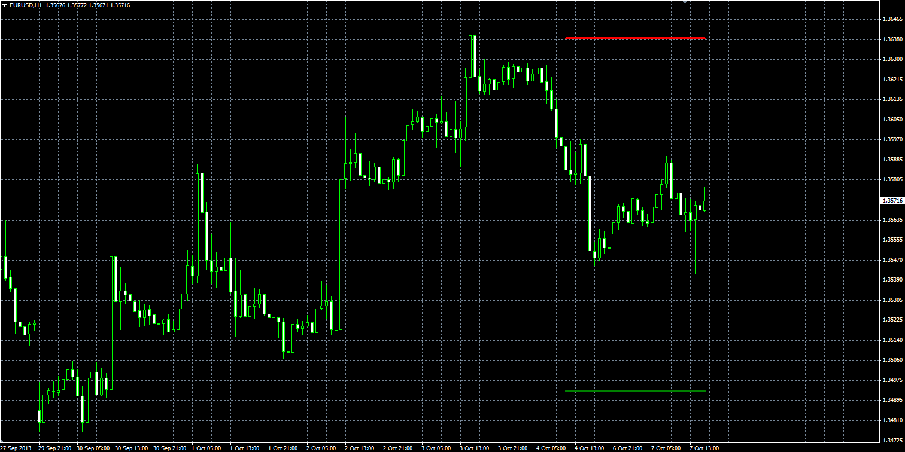

# Simple Support/Resistance indicator

> Source: https://fxcodebase.com/code/viewtopic.php?f=38&t=59639  
> Forum: 38 · Topic 59639 · 1 post(s)

---

## Simple Support/Resistance indicator

**Alexander.Gettinger** · Wed Oct 09, 2013 6:01 pm

Formulas:
Support[i] = 2*Min-Max,
Resistance[i] = 2*Max-Min, where
Max, Min - maximum and minimum prices at range from (i-Length) to (i-1).

 

Download:

 [Simple_Support_Resistance.mq4](files/89931/Simple_Support_Resistance.mq4)
