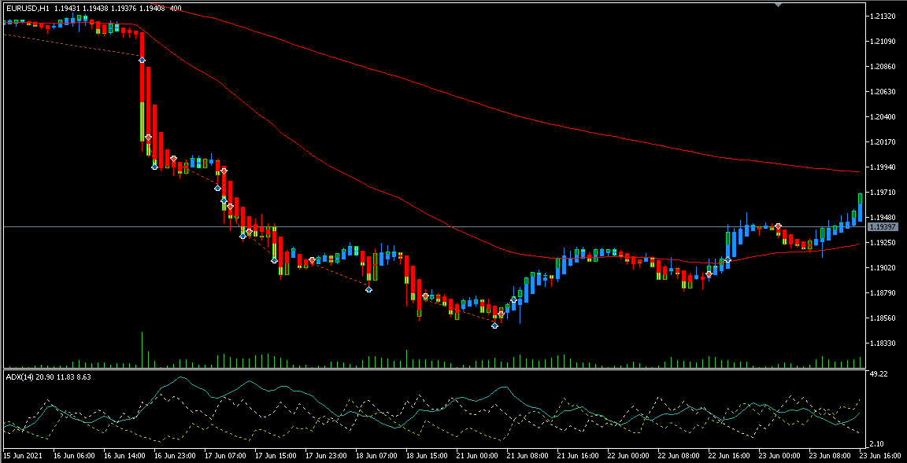
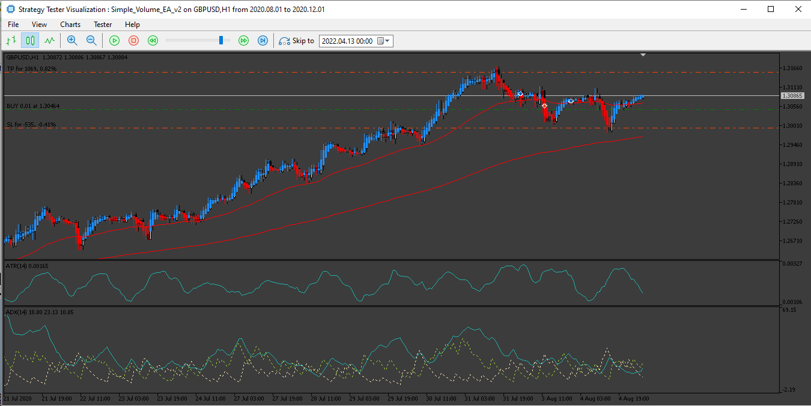

# Simple Volume EA

> Source: https://fxcodebase.com/code/viewtopic.php?f=38&t=72089  
> Forum: 38 · Topic 72089 · 8 post(s)

---

## Simple Volume EA

**Apprentice** · Wed Apr 13, 2022 12:09 pm

Based on the request.
[https://fxcodebase.com/code/viewtopic.php?f=27&p=145523](https://fxcodebase.com/code/viewtopic.php?f=27&p=145523)

 [Simple Volume EA.mq5](files/145678/Simple%20Volume%20EA.mq5)

---

## Re: Simple Volume EA

**virtualmountain** · Wed Apr 13, 2022 2:44 pm

Thank you/Hvala vam!

---

## Re: Simple Volume EA

**PhenomDC** · Sun Oct 16, 2022 5:48 am

Hello Apprentice my guy, could you make an mt4 version of this EA please?

---

## Re: Simple Volume EA

**Apprentice** · Tue Oct 18, 2022 2:04 am

We have added your request to the development list.
Development reference 662.

---

## Re: Simple Volume EA

**Apprentice** · Tue Nov 01, 2022 3:31 am

[Heiken_Ashi.ex4](files/148113/Heiken_Ashi.ex4)

 [Simple_Volume_EA_v1.00.mq4](files/148113/Simple_Volume_EA_v1.00.mq4)

---

## Re: Simple Volume EA

**puneet1979** · Thu May 04, 2023 12:55 am

Hello Apprentice,

Is it possible for you to apply the ATR filter for SL and TP in this EA.
What I am looking for is to put stop loss at mult * atr (14 period )
and then take profit at N * SL or percentage of SL whatever is easy and more efficient.

And just one question can you please tell me why some EAs are slow on tester then others is it because of number of indicators or type of indicators.

---

## Re: Simple Volume EA

**Apprentice** · Sun May 07, 2023 5:00 am

We have added your request to the development list.
Development reference 415.

---

## Re: Simple Volume EA

**Apprentice** · Sat May 13, 2023 10:22 am

 [Simple_Volume_EA_v2.mq5](files/150814/Simple_Volume_EA_v2.mq5)

 [Simple_Volume_EA_v2.00.mq4](files/150814/Simple_Volume_EA_v2.00.mq4)
