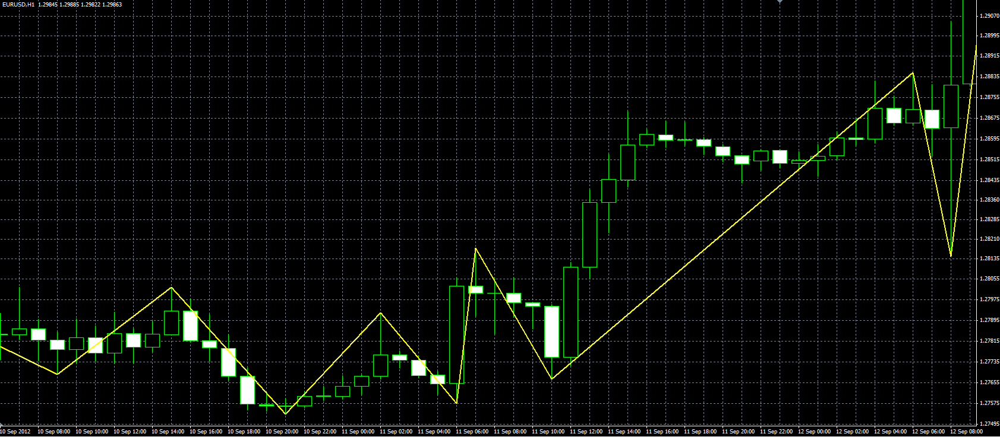
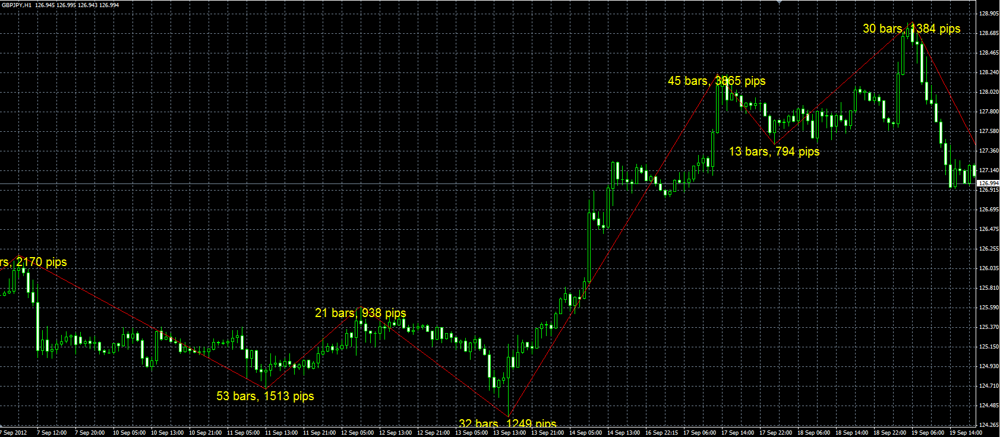

# Simple ZigZag

> Source: https://fxcodebase.com/code/viewtopic.php?f=38&t=23387  
> Forum: 38 · Topic 23387 · 2 post(s)

---

## Simple ZigZag

**Alexander.Gettinger** · Thu Sep 13, 2012 4:12 pm

Simple ZigZag with one parameter (the minimum distance from the peak in pips or percentage).

if Method=0, Step must be in pips,
if Method=1, Step must be in percent.

 

Download:

 [SimpleZZ.mq4](files/40247/SimpleZZ.mq4)

---

## Re: Simple ZigZag

**Alexander.Gettinger** · Fri Sep 21, 2012 2:24 pm

Simple ZigZag with bar and pips counter.

 

Download:

 [SimpleZZ_Counter.mq4](files/40714/SimpleZZ_Counter.mq4)
