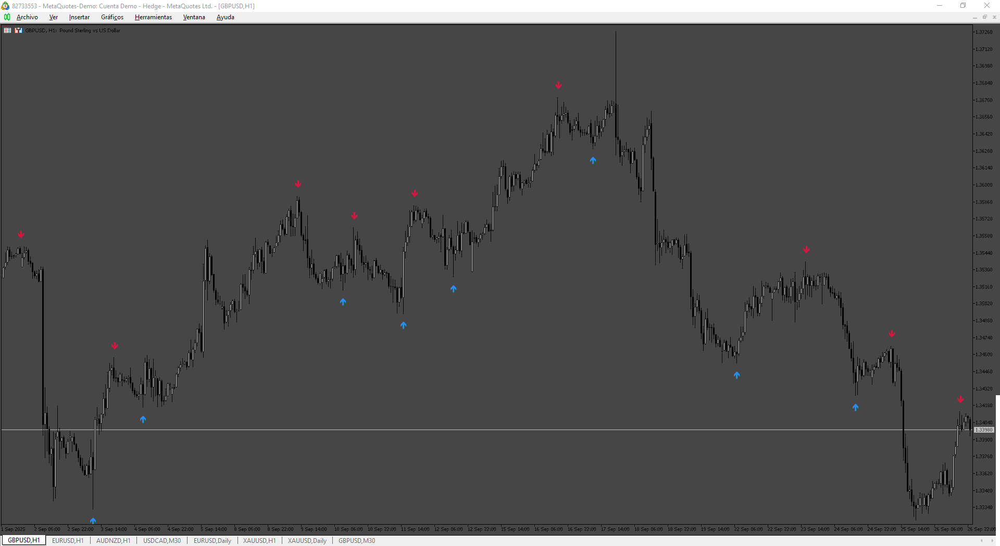

# SinalaArrow

> Source: https://fxcodebase.com/code/viewtopic.php?f=38&t=76327  
> Forum: 38 · Topic 76327 · 9 post(s)

---

## SinalaArrow

**Apprentice** · Sat Sep 27, 2025 3:50 pm

Based on the request.
[https://fxcodebase.com/code/viewtopic.p ... 89#p148489](https://fxcodebase.com/code/viewtopic.php?f=27&p=148489#p148489)

 [SinalaArrow.mq5](files/160640/SinalaArrow.mq5)

---

## Re: SinalaArrow

**Nino1906** · Sun Sep 28, 2025 5:12 am

can you it be done in mt4 version with fix aplied ?

---

## Re: SinalaArrow

**Apprentice** · Wed Oct 01, 2025 6:17 am

We have added your request to the development list.
Development reference 621

---

## Re: SinalaArrow

**khanatd** · Wed Oct 01, 2025 10:50 pm

sir mt4 version with nrp arrows at close of current live candle plz, thanks
khan

---

## Re: SinalaArrow

**Apprentice** · Sat Oct 04, 2025 2:51 pm

We have added your request to the development list.
Development reference 636

---

## Re: SinalaArrow

**Apprentice** · Mon Oct 06, 2025 4:32 am

MT4 version.

 [SignalaArrow_v3.0.mq4](files/160786/SignalaArrow_v3.0.mq4)

---

## Re: SinalaArrow

**khanatd** · Tue Oct 07, 2025 1:51 pm

thanks, make it 100% non repaint just one signal arrow and not clutter of them, at close of current candle should appear,

thanks
khan

---

## Re: SinalaArrow

**Apprentice** · Sun Oct 12, 2025 2:38 am

We have added your request to the development list.
Development reference 663

---

## Re: SinalaArrow

**Apprentice** · Sat Oct 18, 2025 1:05 pm

[SignalaArrow_v4.0.mq4](files/160917/SignalaArrow_v4.0.mq4)

## Todo
thanks, make it 100% non repaint just one signal arrow and not clutter of them, at close of current candle should appear,
## Done
