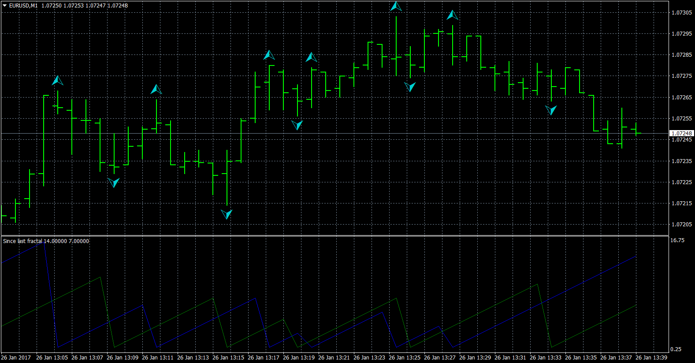
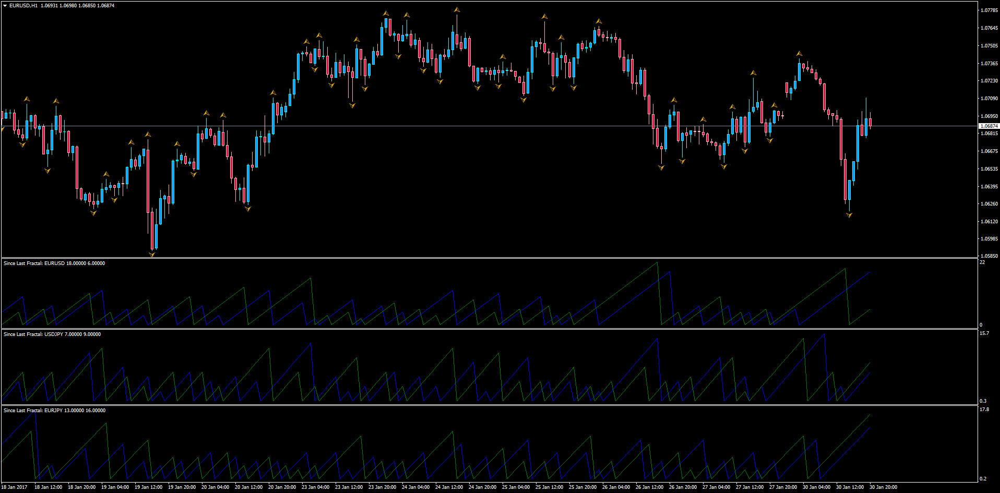
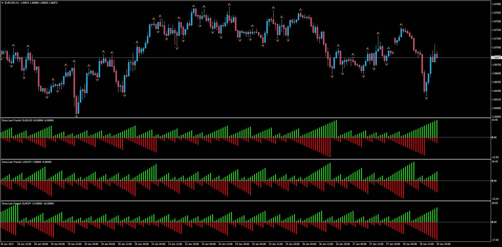
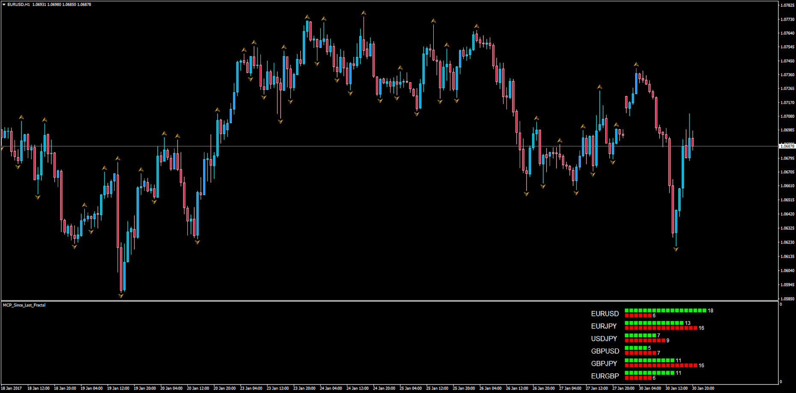

# Since last fractal

> Source: https://fxcodebase.com/code/viewtopic.php?f=38&t=64346  
> Forum: 38 · Topic 64346 · 4 post(s)

---

## Since last fractal

**Apprentice** · Thu Jan 26, 2017 7:37 am

Based on the original lua.
[viewtopic.php?f=17&t=64075](https://fxcodebase.com/code/viewtopic.php?f=17&t=64075)

 [Since last fractal.mq4](files/110722/Since%20last%20fractal.mq4)

 

 [Since_Last_Fractal.mq4](files/110722/Since_Last_Fractal.mq4)

 

 [Since_Last_Fractal_Histo.mq4](files/110722/Since_Last_Fractal_Histo.mq4)

 

 [MCP_Since_Last_Fractal.mq4](files/110722/MCP_Since_Last_Fractal.mq4)

---

## Re: Since last fractal

**optionhk** · Sun Jan 29, 2017 6:13 am

It is a good indicator. Can you please have an input for symbol so that a comparision can be made of a few pairs on a single chart. thank you.

---

## Re: Since last fractal

**Apprentice** · Mon Jan 30, 2017 3:35 am

Your request is added to the development list, Under Id Number 3730
 If someone is interested to do this task, please contact me.

---

## Re: Since last fractal

**Apprentice** · Tue Jan 31, 2017 4:59 am

Try Since_Last_Fractal.mq4
