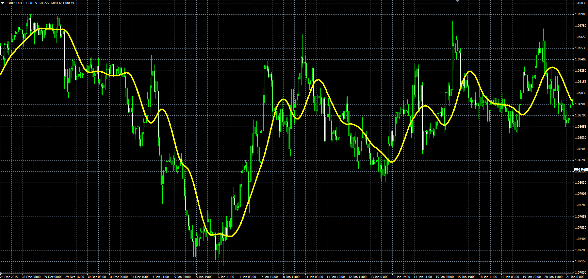

# Sine Weighted Moving Average

> Source: https://fxcodebase.com/code/viewtopic.php?f=38&t=63064  
> Forum: 38 · Topic 63064 · 1 post(s)

---

## Sine Weighted Moving Average

**Alexander.Gettinger** · Mon Jan 25, 2016 9:12 am

**Sine Weighted Moving Average**

Formula:
SineWMA[i]=Sum/Weight, where
Sum=Price[i-N+1]*sin(PI*(N)/(N+1))+Price[i-N+2]*sin(PI*(N-1)/(N+1))+…+Price[i]*sin(PI*1/(N+1))
Weight= sin(PI*(N)/(N+1))+ sin(PI*(N-1)/(N+1))+…+ sin(PI*1/(N+1)).

 

Download:

 [SineWMA.mq4](files/104417/SineWMA.mq4)
