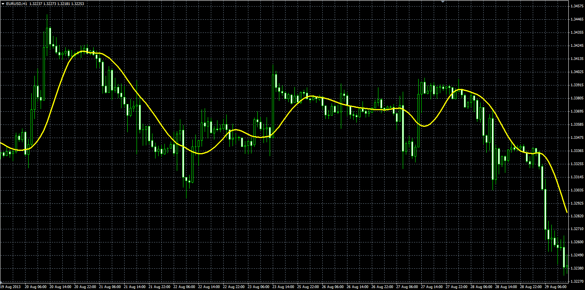

# Sine-Weighted Moving Average

> Source: https://fxcodebase.com/code/viewtopic.php?f=38&t=59353  
> Forum: 38 · Topic 59353 · 1 post(s)

---

## Sine-Weighted Moving Average

**Alexander.Gettinger** · Thu Aug 29, 2013 11:09 am

Original LUA indicator: [http://fxcodebase.com/code/viewtopic.php?f=17&t=49601](https://fxcodebase.com/code/viewtopic.php?f=17&t=49601).

 

Download:

 [SWMA.mq4](files/89018/SWMA.mq4)
