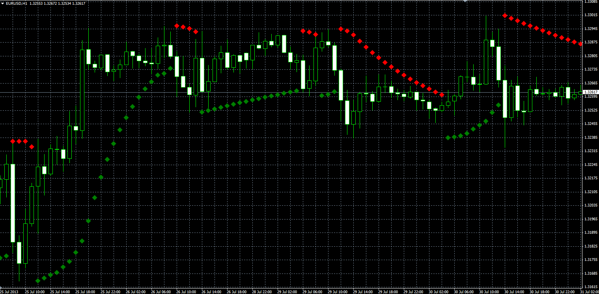

# Single Stream SAR

> Source: https://fxcodebase.com/code/viewtopic.php?f=38&t=59131  
> Forum: 38 · Topic 59131 · 7 post(s)

---

## Single Stream SAR

**Alexander.Gettinger** · Wed Aug 14, 2013 3:12 pm

Original LUA indicator: [http://fxcodebase.com/code/viewtopic.php?f=17&t=29613](https://fxcodebase.com/code/viewtopic.php?f=17&t=29613).

 

Download:

 [SSSAR.mq4](files/88588/SSSAR.mq4)

---

## Re: Single Stream SAR

**spanizh_fly** · Wed Jun 03, 2015 7:00 am

any chances you can have an alert when the signal changes
especially in the 1 hr or the 30 minute time frame?

---

## Re: Single Stream SAR

**Apprentice** · Fri Jun 05, 2015 4:26 am

Your request is added to the development list.

---

## Re: Single Stream SAR

**spanizh_fly** · Wed Jun 10, 2015 4:33 am

Thank you for your reply

---

## Re: Single Stream SAR

**Alexander.Gettinger** · Mon Dec 17, 2018 10:01 pm

Please try this version of the indicator:

 [SSSAR.mq4](files/122905/SSSAR.mq4)

---

## Re: Single Stream SAR

**Gilles** · Thu Aug 10, 2023 10:42 am

Hi Apprentice,
How do you achieve the "LINE" style as seen in the "SSSAR" version in LUA?
It's visually easier to interpret than the "DOT" style in MT4.
Thank you in advance.

---

## Re: Single Stream SAR

**Apprentice** · Wed Aug 16, 2023 3:10 pm

if the "Line" Method is used we have
SAR = instance:addStream("UP", core.Line,
in this case, you can select the dot line style option.
else
SAR = instance:addStream("UP", core.Dot
