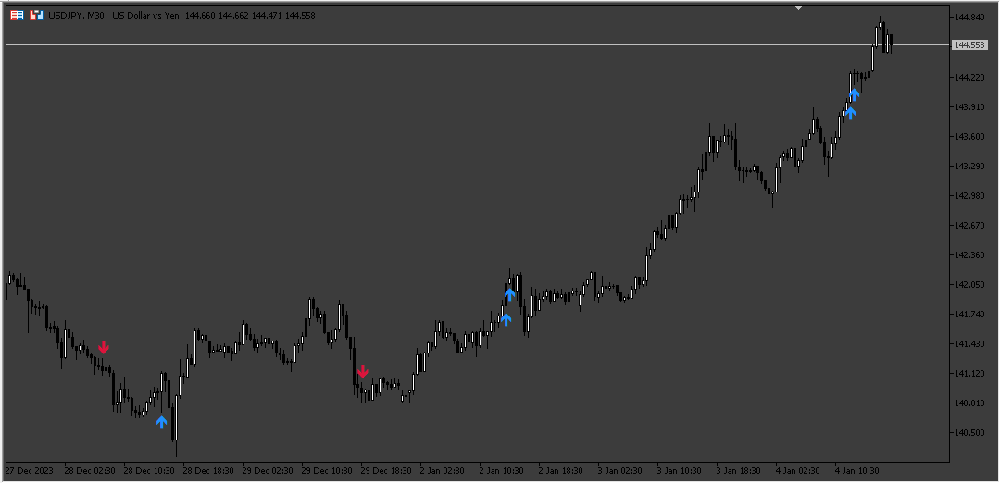
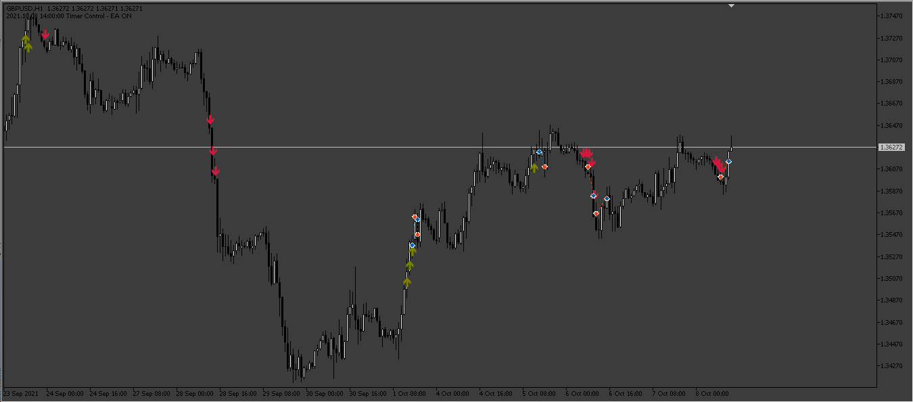
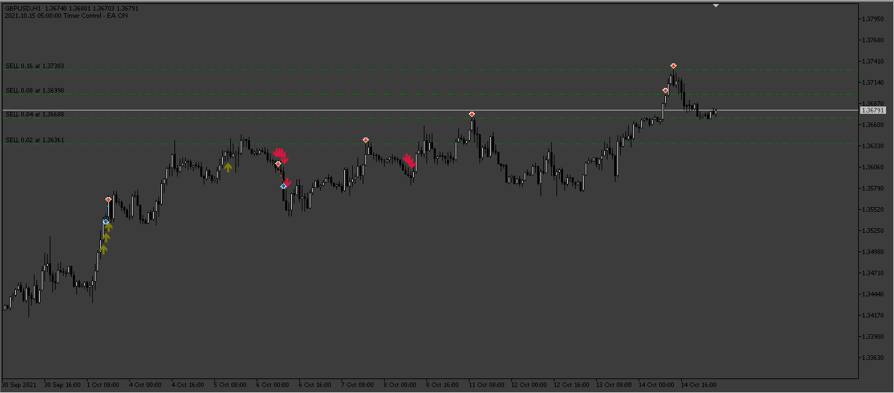
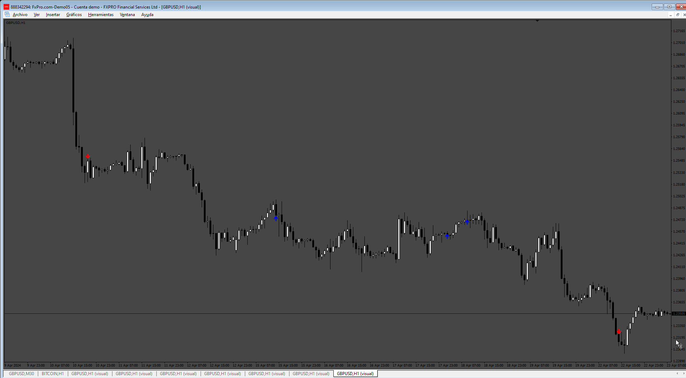
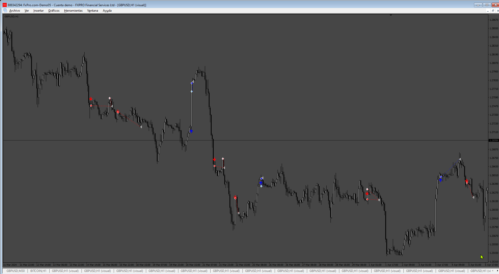

# Six_Soldiers_EA

> Source: https://fxcodebase.com/code/viewtopic.php?f=38&t=74514  
> Forum: 38 · Topic 74514 · 7 post(s)

---

## Six_Soldiers_EA

**Apprentice** · Sat Jan 06, 2024 2:43 am

 

Based on the request.
[https://fxcodebase.com/code/viewtopic.php?f=38&t=74474](https://fxcodebase.com/code/viewtopic.php?f=38&t=74474)

 [Six_Soldiers.mq5](files/153937/Six_Soldiers.mq5)

 [Six_Soldiers_EA.mq5](files/153937/Six_Soldiers_EA.mq5)

---

## Re: Six_Soldiers_EA

**fsmith** · Wed Jan 17, 2024 9:42 am

Cool! thanks a lot, work fine, just you could add a method to recover the losses, like a grid for example?

---

## Re: Six_Soldiers_EA

**Apprentice** · Sat Jan 20, 2024 4:18 am

We have added your request to the development list.
Development reference 79

---

## Re: Six_Soldiers_EA

**Apprentice** · Tue Feb 06, 2024 6:53 pm

 [Six_Soldiers_EA_Grid.mq5](files/154305/Six_Soldiers_EA_Grid.mq5)

---

## Re: Six_Soldiers_EA

**anangfx** · Sat Jun 08, 2024 10:22 pm

HI

could you make this mt4 version ?? thx very much

---

## Re: Six_Soldiers_EA

**Apprentice** · Wed Jun 12, 2024 3:19 pm

We have added your request to the development list.
Development reference 494

---

## Re: Six_Soldiers_EA

**Apprentice** · Tue Jun 18, 2024 1:49 pm

 

 [six_soldiers_Indicator.mq4](files/155806/six_soldiers_Indicator.mq4)

 [six_soldiers_EA.mq4](files/155806/six_soldiers_EA.mq4)
