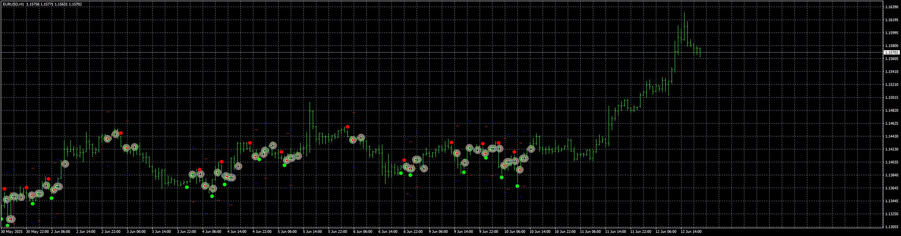

# Sixty_Second_Trades_EA_v1.00

> Source: https://fxcodebase.com/code/viewtopic.php?f=38&t=76037  
> Forum: 38 · Topic 76037 · 4 post(s)

---

## Sixty_Second_Trades_EA_v1.00

**Apprentice** · Wed Jun 18, 2025 11:07 am

Based on the request.
[https://fxcodebase.com/code/viewtopic.php?f=38&t=76028](https://fxcodebase.com/code/viewtopic.php?f=38&t=76028)
The indicator repaints heavily, so I added a "check signal back" option because of this.

 [Sixty Second Trades Alert MTF TT.mq4](files/159613/Sixty%20Second%20Trades%20Alert%20MTF%20TT.mq4)

 [Sixty_Second_Trades_EA_v1.00.mq4](files/159613/Sixty_Second_Trades_EA_v1.00.mq4)

---

## Re: Sixty_Second_Trades_EA_v1.00

**Peter13** · Thu Jun 19, 2025 9:41 am

thx, ea oppened buy order, but there wasn't signal.

---

## Re: Sixty_Second_Trades_EA_v1.00

**Apprentice** · Sat Jun 21, 2025 1:08 pm

We have added your request to the development list.
Development reference 406

---

## Re: Sixty_Second_Trades_EA_v1.00

**Apprentice** · Fri Jun 27, 2025 3:56 am

[Sixty_Second_Trades_EA_v1.10.mq4](files/159756/Sixty_Second_Trades_EA_v1.10.mq4)

Try this version.
