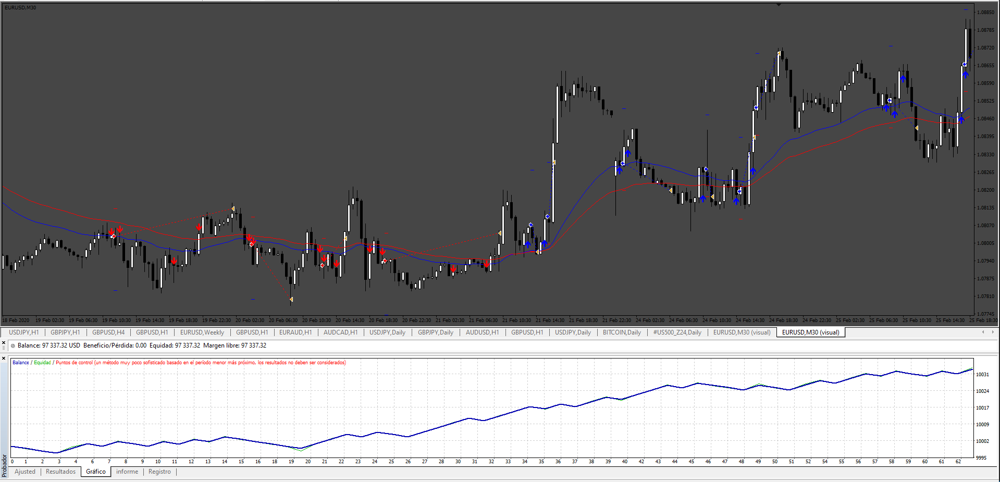
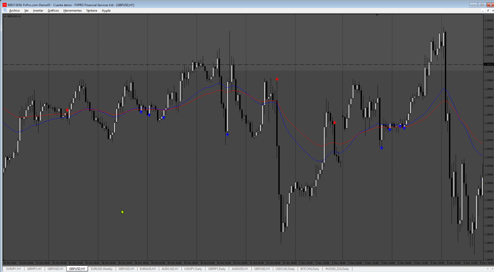

# Sling_Shot_System_EA

> Source: https://fxcodebase.com/code/viewtopic.php?f=38&t=75366  
> Forum: 38 · Topic 75366 · 4 post(s)

---

## Sling_Shot_System_EA

**Apprentice** · Fri Nov 22, 2024 12:40 pm

Based on the request.
[https://fxcodebase.com/code/viewtopic.php?f=38&t=75323](https://fxcodebase.com/code/viewtopic.php?f=38&t=75323)

 [Sling_Shot_System.ex4](files/157305/Sling_Shot_System.ex4)

 [Sling_Shot_System_EA.mq4](files/157305/Sling_Shot_System_EA.mq4)

---

## Re: Sling_Shot_System_EA

**trtrader** · Sat Nov 23, 2024 9:44 pm

Hi,

Could you please add the following?

1. I think the logic needs to be refined a bit as it does print a lot of signals and not giving the same exact signals as Trading View Sling Shot

2. Close By EMA 38/62 Cross ( if true, the trade will remain open until opposite EMA cross)

---

## Re: Sling_Shot_System_EA

**Apprentice** · Wed Nov 27, 2024 2:49 pm

We have added your request to the development list.
Development reference 881

---

## Re: Sling_Shot_System_EA

**Apprentice** · Sun Dec 01, 2024 5:23 am

 [Sling_Shot_System.mq4](files/157403/Sling_Shot_System.mq4)

 [Sling_Shot_System_EA_v2.mq4](files/157403/Sling_Shot_System_EA_v2.mq4)
