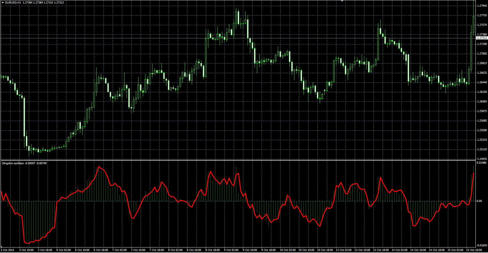

# Slingshot indicator

> Source: https://fxcodebase.com/code/viewtopic.php?f=38&t=61367  
> Forum: 38 · Topic 61367 · 1 post(s)

---

## Slingshot indicator

**Alexander.Gettinger** · Thu Oct 23, 2014 9:47 am

Original LUA indicator: [viewtopic.php?f=17&t=25752](https://fxcodebase.com/code/viewtopic.php?f=17&t=25752).

Formulas:
Histogram[i] = Price1[i]-Price1[i-Length1],
Line[i] = Price2[i]-Price2[i-Length2].

 

Download:

 [Slingshot.mq4](files/96700/Slingshot.mq4)
