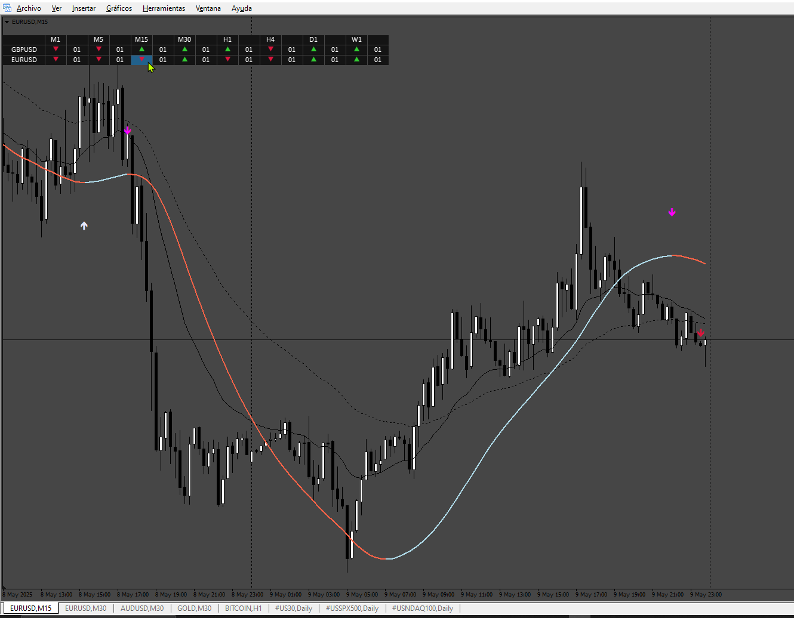

# slope-direction-line-indicator+alert

> Source: https://fxcodebase.com/code/viewtopic.php?f=38&t=73977  
> Forum: 38 · Topic 73977 · 4 post(s)

---

## slope-direction-line-indicator+alert

**Apprentice** · Wed Jul 26, 2023 11:31 am

Based on the request.
[https://fxcodebase.com/code/viewtopic.php?f=27&p=151676](https://fxcodebase.com/code/viewtopic.php?f=27&p=151676)

 [slope-direction-line-indicator+alert.mq4](files/151812/slope-direction-line-indicatoralert.mq4)

---

## Re: slope-direction-line-indicator+alert

**Teruyoshi** · Fri May 02, 2025 10:44 pm

It would be of great value to all if there is a scanner type indicator of this.
 Would you make one?
 Many thanks in advance.

---

## Re: slope-direction-line-indicator+alert

**Apprentice** · Wed May 07, 2025 12:31 pm

We have added your request to the development list.
Development reference 313

---

## Re: slope-direction-line-indicator+alert

**Apprentice** · Tue May 13, 2025 3:47 am

 [Slope_Direction_Dashboard.mq4](files/159222/Slope_Direction_Dashboard.mq4)
