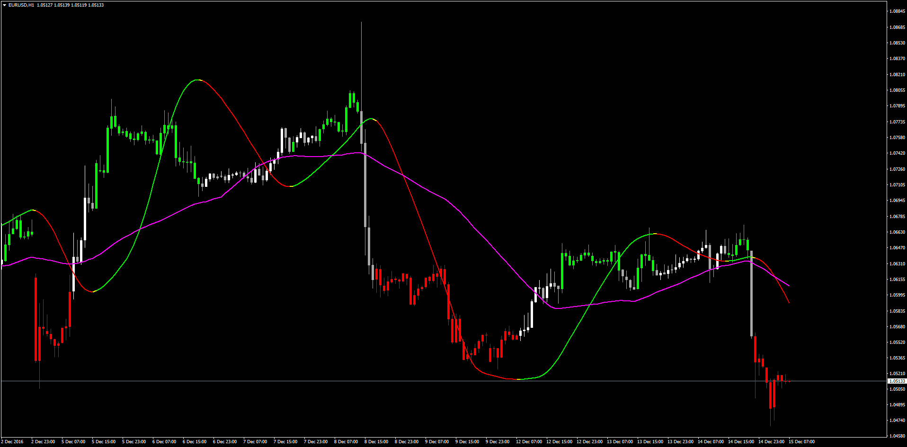

# Slope Direction Line / Moving Average Confirmation

> Source: https://fxcodebase.com/code/viewtopic.php?f=38&t=64218  
> Forum: 38 · Topic 64218 · 1 post(s)

---

## Slope Direction Line / Moving Average Confirmation

**Apprentice** · Fri Dec 16, 2016 10:07 am

LUA Original: [viewtopic.php?f=17&t=2648](https://fxcodebase.com/code/viewtopic.php?f=17&t=2648)

Description:

This Price Overlay (Color Candles) Indicator shows when the Slope Direction Line and MA are in harmony.

When Current SDL > Previous SDL And Current MA > Previous MA Then Price Overlay is Green

Viceversa for the Down.

Make sure to uncheck the Chart on Foreground in the Chart Properties (F8).
