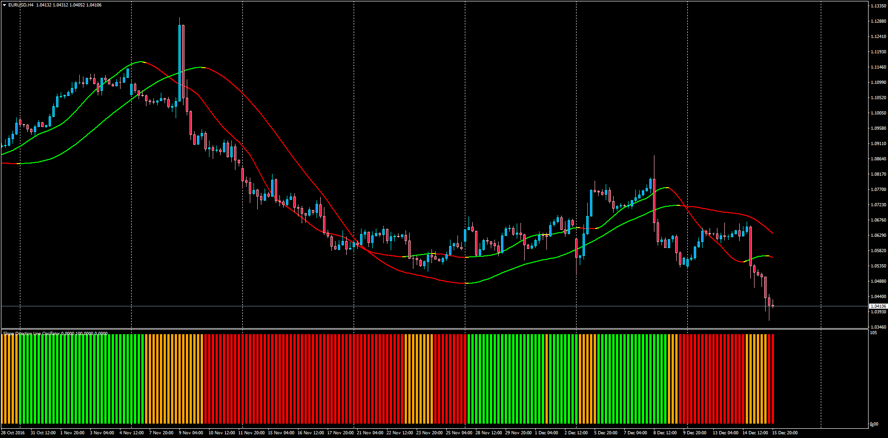

# Slope Direction Line Oscillator

> Source: https://fxcodebase.com/code/viewtopic.php?f=38&t=64217  
> Forum: 38 · Topic 64217 · 1 post(s)

---

## Slope Direction Line Oscillator

**Apprentice** · Fri Dec 16, 2016 4:05 am

LUA Original: [viewtopic.php?f=17&t=1670](https://fxcodebase.com/code/viewtopic.php?f=17&t=1670)

Description:

This oscillator will show green color when both Slope Direction Lines go up and red when they go down; orange when there is no agreement.

Note: Slope_Direction_Line.mq4 calculations are embeded into the code so no need to call any other indicator.

 [Slope_Direction_Line.mq4](files/109951/Slope_Direction_Line.mq4)

 [Slope_Direction_Line_Oscillator.mq4](files/109951/Slope_Direction_Line_Oscillator.mq4)
