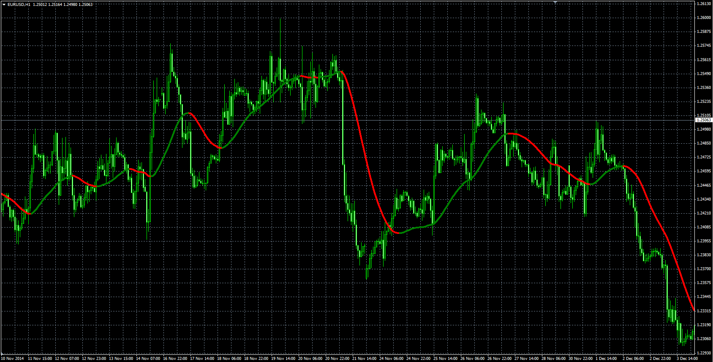
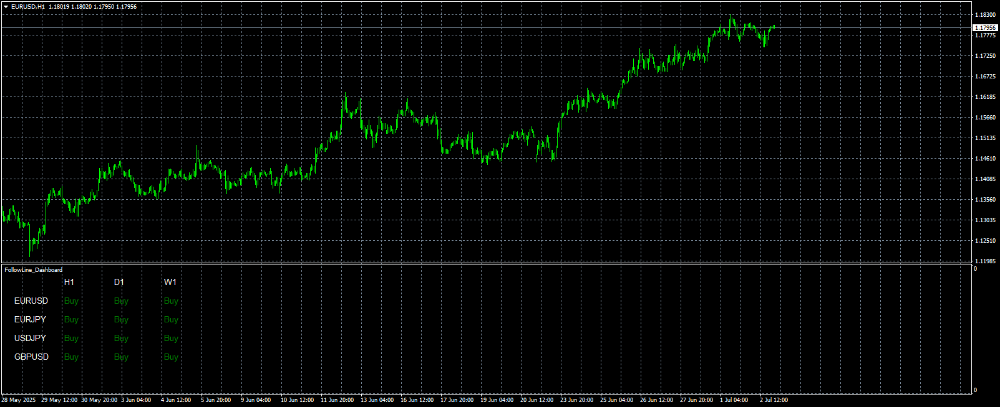

# Slope Direction Line

> Source: https://fxcodebase.com/code/viewtopic.php?f=38&t=61635  
> Forum: 38 · Topic 61635 · 4 post(s)

---

## Slope Direction Line

**Alexander.Gettinger** · Tue Dec 23, 2014 8:36 am

Formulas:
SDL = MA(vect) with [Sqrt(Length)] number of periods and [Method] type, where
vect = 2*MA2-MA,
MA2 - MA(Price) with [Length/2] number of periods and [Method] type,
MA - MA(Price) with [Length] number of periods and [Method] type.

 

Download:

 [Slope_Direction_Line.mq4](files/97864/Slope_Direction_Line.mq4)

---

## Re: Slope Direction Line

**Teruyoshi** · Mon May 05, 2025 8:44 am

I know there is already a Slope Direction Line scanner indicator but would you spare your time and make the latest one using this mq4 file attatched?
I appreciate your generousity. Many thanks in advance.

---

## Re: Slope Direction Line

**Apprentice** · Wed May 07, 2025 12:23 pm

We have added your request to the development list.
Development reference 306

---

## Re: Slope Direction Line

**Apprentice** · Wed Jul 02, 2025 3:46 pm

 [Slope Direction Line.mq4](files/159818/Slope%20Direction%20Line.mq4)

 [Slope_Direction_Dashboard.mq4](files/159818/Slope_Direction_Dashboard.mq4)
