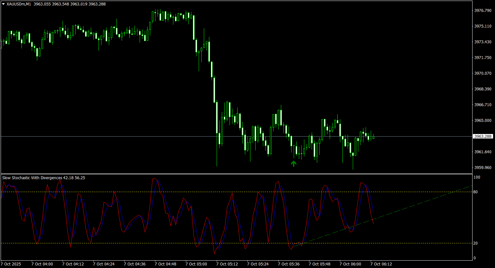

# Slow_Stochastic_with_divergences

> Source: https://fxcodebase.com/code/viewtopic.php?f=38&t=76370  
> Forum: 38 · Topic 76370 · 3 post(s)

---

## Slow_Stochastic_with_divergences

**Apprentice** · Sun Oct 12, 2025 3:37 am

TS2 version.
[https://fxcodebase.com/code/viewtopic.p ... 72#p160672](https://fxcodebase.com/code/viewtopic.php?f=17&p=160672#p160672)

 [Slow_Stochastic_with_divergences.mq4](files/160880/Slow_Stochastic_with_divergences.mq4)

---

## Re: Slow_Stochastic_with_divergences

**khanatd** · Sun Oct 12, 2025 11:41 pm

thanks a lot sir for your kindness, does arrow is nrp 100% and appears at close of current candle? can u make extra input in it for PastCandles( ) , if we write number of candles so in this range it will show past divergences too? with mt4 EA too trading on its arrows with trailing and multiplier , TP$ SL$ TP PIPS, SL PIPS,
thanks
khan

---

## Re: Slow_Stochastic_with_divergences

**Apprentice** · Sat Oct 18, 2025 1:21 pm

We have added your request to the development list.
Development reference 670
