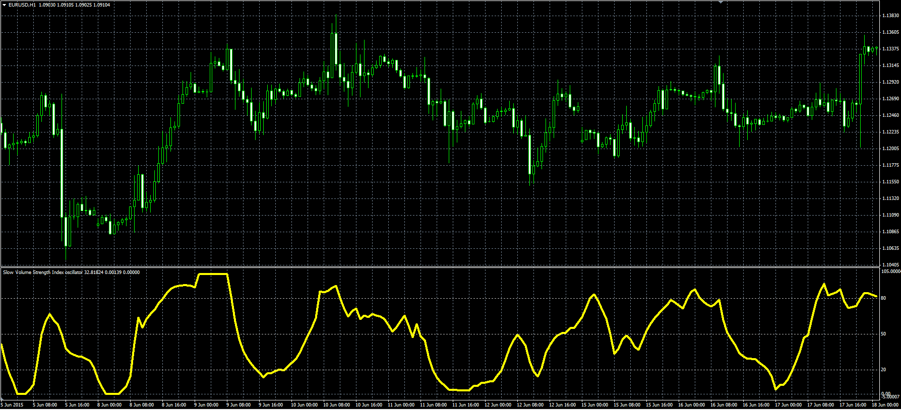
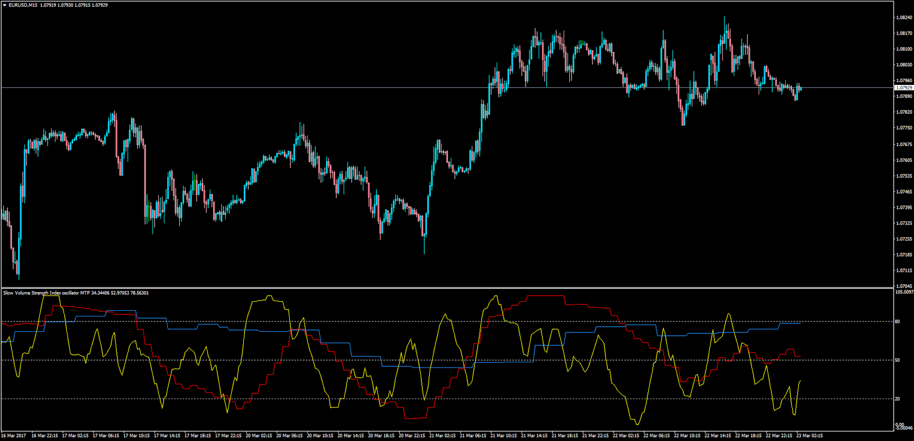

# Slow Volume Strength Index

> Source: https://fxcodebase.com/code/viewtopic.php?f=38&t=62453  
> Forum: 38 · Topic 62453 · 11 post(s)

---

## Slow Volume Strength Index

**Alexander.Gettinger** · Wed Jul 22, 2015 3:06 pm

This indicator has been described in the Stock&Commodities (August 2015).

 

 [SVSI.mq4](files/101515/SVSI.mq4)

 

 [SVSI_MTF.mq4](files/101515/SVSI_MTF.mq4)

---

## Re: Slow Volume Strength Index

**cezion** · Sat Mar 18, 2017 4:41 pm

Please make MTF version, if it is possible.Thanks

---

## Re: Slow Volume Strength Index

**Apprentice** · Tue Mar 21, 2017 4:15 am

Your request is added to the development list, Under Id Number 3769
 If someone is interested to do this task, please contact me.

---

## Re: Slow Volume Strength Index

**Apprentice** · Thu Mar 23, 2017 1:29 pm

SVSI_MTF.mq4 added.

---

## Re: Slow Volume Strength Index

**cezion** · Fri Mar 24, 2017 9:32 am

Thank you very much, I did not expect it would be so fast ! Thanks again !!!

---

## Re: Slow Volume Strength Index

**durlovjagiroad** · Sat Oct 26, 2019 3:55 am

want SVSI_MTF for custom currency pair eg.EUROUSD, USDINR etc.. whatever I want from watchlist.

---

## Re: Slow Volume Strength Index

**Apprentice** · Sat Oct 26, 2019 4:51 am

Your request is added to the development list.
Development reference 246.

---

## Re: Slow Volume Strength Index

**Apprentice** · Tue Oct 29, 2019 6:17 am

Try this version.

 [SVSI_MTF_durlovjagiroad.mq4](files/129466/SVSI_MTF_durlovjagiroad.mq4)

---

## Re: Slow Volume Strength Index

**durlovjagiroad** · Tue Oct 29, 2019 6:30 am

Many Thanks

---

## Re: Slow Volume Strength Index

**sydneygithinji** · Wed Apr 01, 2020 2:42 am

Hi,
Please develop a currency strength indicator using Apollo parameters, pls go to the you tube link below for more clarification: [https://youtu.be/DFdj9skeED](https://youtu.be/DFdj9skeED)

Regards
Sydney

---

## Re: Slow Volume Strength Index

**Apprentice** · Wed Apr 01, 2020 6:08 am

Video unavailable.
Can you provide a code, formula or description?
