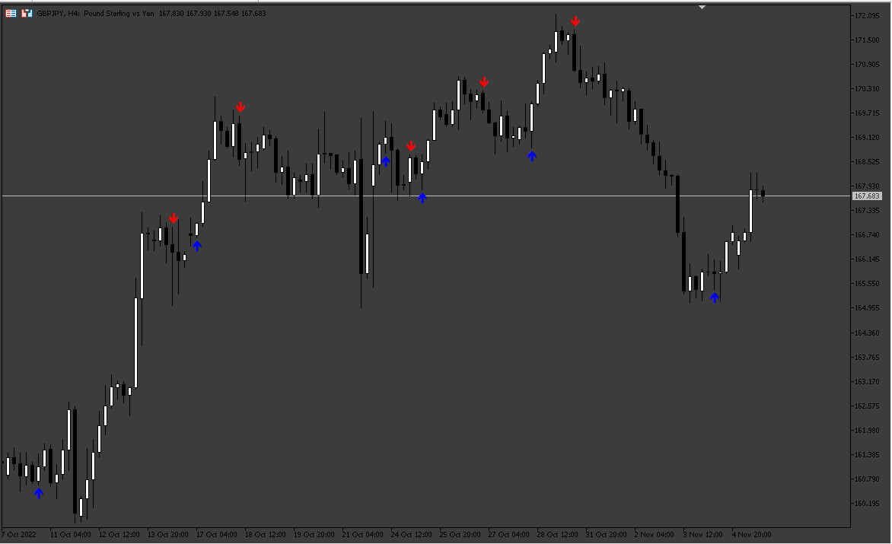

# SMA_CrossOver

> Source: https://fxcodebase.com/code/viewtopic.php?f=38&t=72918  
> Forum: 38 · Topic 72918 · 5 post(s)

---

## SMA_CrossOver

**Apprentice** · Tue Nov 08, 2022 9:36 am

Based on the request.
[https://fxcodebase.com/code/viewtopic.php?f=27&p=148177](https://fxcodebase.com/code/viewtopic.php?f=27&p=148177)

 [SMA_CrossOver.mq5](files/148229/SMA_CrossOver.mq5)

---

## Re: SMA_CrossOver

**zukolee** · Tue Nov 08, 2022 1:10 pm

> **Apprentice wrote:**
>
>
> 717Pic.png
>
>
> Based on the request.
> [https://fxcodebase.com/code/viewtopic.php?f=27&p=148177](https://fxcodebase.com/code/viewtopic.php?f=27&p=148177)
>
>
> SMA_CrossOver.mq5

Thanks a lot for the help. However, some candles only appear the arrow during the formation of the next candle, and not right at the close of the current candle. Would it be possible to modify it so that arrows appear right at the closing of the candle that gives a signal and not wait for the next candle?

---

## Re: SMA_CrossOver

**zukolee** · Fri Nov 11, 2022 9:09 am

> **Apprentice wrote:**
>
>
> 717Pic.png
>
>
> Based on the request.
> [https://fxcodebase.com/code/viewtopic.php?f=27&p=148177](https://fxcodebase.com/code/viewtopic.php?f=27&p=148177)
>
>
> SMA_CrossOver.mq5

Thank you very much! Could you make one last change? Plot only the arrows where the signal is on the candle that has just closed, and not plot arrows on the previous (late) candle, only on the current one. It's possible? THX

---

## Re: SMA_CrossOver

**Apprentice** · Sun Nov 13, 2022 3:36 am

We have added your request to the development list.
Development reference 729.

---

## Re: SMA_CrossOver

**Apprentice** · Mon Jan 20, 2025 10:41 am

Try it now.
