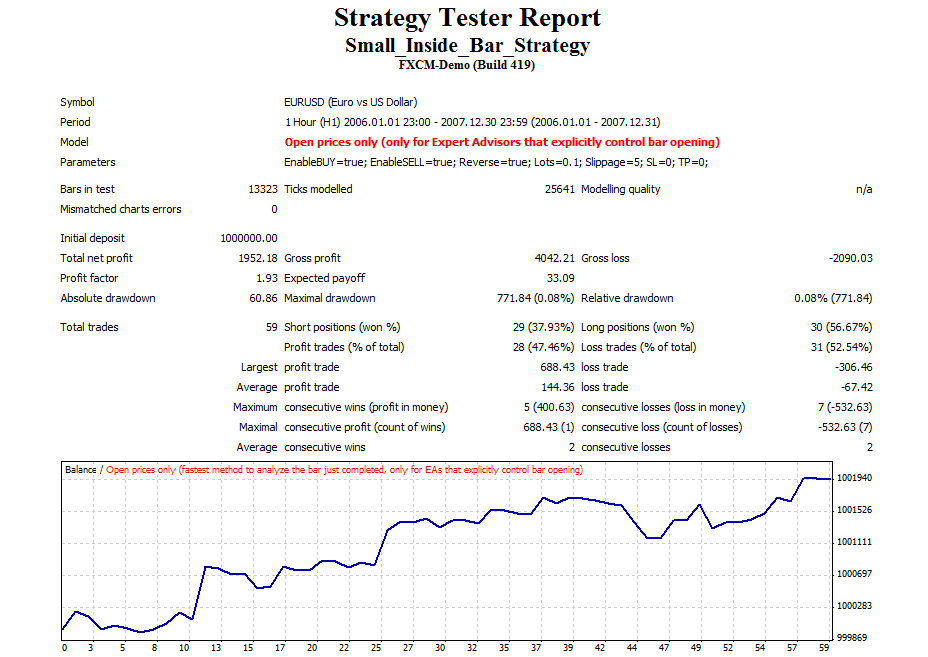

# Small inside bar strategy

> Source: https://fxcodebase.com/code/viewtopic.php?f=38&t=18292  
> Forum: 38 · Topic 18292 · 2 post(s)

---

## Small inside bar strategy

**Alexander.Gettinger** · Mon May 14, 2012 9:03 am

This strategy uses the Small inside bar indicator ([viewtopic.php?f=38&t=18179](https://fxcodebase.com/code/viewtopic.php?f=38&t=18179)).

 

Download:

 [Small_Inside_Bar_Strategy.mq4](files/32956/Small_Inside_Bar_Strategy.mq4)

---

## Re: Small inside bar strategy

**dokopy** · Thu Jan 09, 2014 4:13 am

Please add a variable to set the minimum length of the candle.
