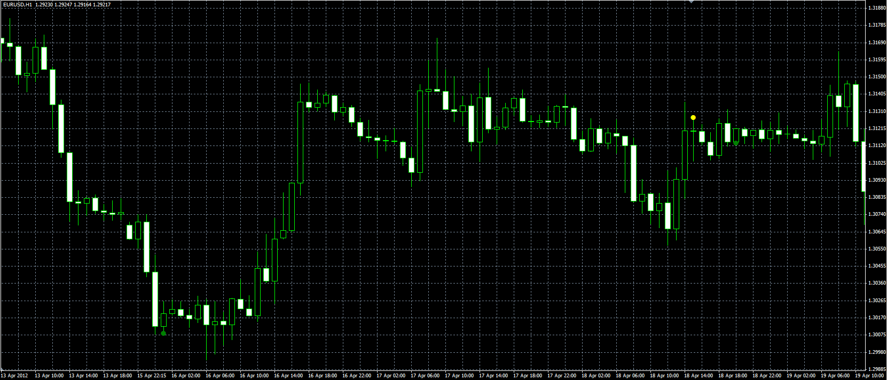

# Small inside bar

> Source: https://fxcodebase.com/code/viewtopic.php?f=38&t=18179  
> Forum: 38 · Topic 18179 · 7 post(s)

---

## Small inside bar

**Alexander.Gettinger** · Fri May 11, 2012 3:25 pm

Original indicator: [viewtopic.php?f=17&t=18178&p=32808#p32808](https://fxcodebase.com/code/viewtopic.php?f=17&t=18178&p=32808#p32808)

> Bullish small inside bar conditions:
> 1. High[i]<High[i-1],
> 2. Low[i]>Low[i-1],
> 3. (High[i-1]-Low[i-1])/(High[i]-Low[i]) >2,
> 4. Close[i]>Open[i],
> 5. High[i]<Median[i-1],
> 6. Close[i-1]<Open[i-1].
>
> Bearish small inside bar conditions:
> 1. High[i]<High[i-1],
> 2. Low[i]>Low[i-1],
> 3. (High[i-1]-Low[i-1])/(High[i]-Low[i]) >2,
> 4. Close[i]<Open[i],
> 5. Low[i]<Median[i-1],
> 6. Close[i-1]>Open[i-1].

 

Download:

 [Small_Inside_Bar.mq4](files/32809/Small_Inside_Bar.mq4)

---

## Re: Small inside bar

**Alexander.Gettinger** · Mon May 14, 2012 9:05 am

Strategy based on this indicator: [viewtopic.php?f=38&t=18292](https://fxcodebase.com/code/viewtopic.php?f=38&t=18292)

---

## Re: Small inside bar

**jamestoday78** · Thu Jan 24, 2013 3:16 am

Hey all, can someone explain the whole rules on this EA, looks open to problems with there being no SL built in, or am I reading it wrong?

---

## Re: Small inside bar

**Alexander.Gettinger** · Mon Jan 28, 2013 4:30 pm

The EA opens orders in accordance with the terms described above.

---

## Re: Small inside bar

**logicgate** · Thu Jan 20, 2022 5:19 pm

Hi there my friend.

Can you compile a version of this indicator which will paint the inside bar a different color instead of marking it with a dot?

For example if I have white bullish bars and black bearish bars, I would like to see the inside bar as orange.

---

## Re: Small inside bar

**Apprentice** · Fri Jan 21, 2022 9:16 am

Your request is added to the development list.
Development reference 53.

---

## Re: Small inside bar

**Apprentice** · Wed Mar 16, 2022 11:52 am

Try this version.
[https://fxcodebase.com/code/viewtopic.php?f=38&t=71974](https://fxcodebase.com/code/viewtopic.php?f=38&t=71974)
