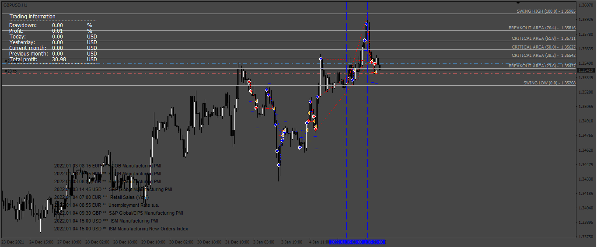

# SMART FIBO

> Source: https://fxcodebase.com/code/viewtopic.php?f=38&t=74216  
> Forum: 38 · Topic 74216 · 7 post(s)

---

## SMART FIBO

**Apprentice** · Mon Oct 02, 2023 1:46 pm

Based on the request.
[https://fxcodebase.com/code/viewtopic.php?f=27&p=152707](https://fxcodebase.com/code/viewtopic.php?f=27&p=152707)

 [SMARTFIBO.mq4](files/152784/SMARTFIBO.mq4)

---

## Re: SMART FIBO

**lukgoku** · Wed Oct 04, 2023 2:13 am

Hi Apprentice, hope you're well.

I've this error when i use with Dax:

2023.10.04 09:05:00.512	SMARTFIBO DAX_ecn,M5: BUYSTOP Send Error Code: 4051 Message: invalid function parameter value LT: 0.0 OP: 14983.2 SL: 0.0 TP: 0.0 Bid: 14972.2 Ask: 14973.2

2023.10.03 22:49:59.200	SMARTFIBO DAX_ecn,M5: SELLSTOP Send Error Code: 4051 Message: invalid function parameter value LT: 0.0 OP: 15061.9 SL: 0.0 TP: 0.0 Bid: 15071.9 Ask: 15081.0

SL and TP are off, i don't know why, i tried many configuration but nothing.

Could you help me please?

---

## Re: SMART FIBO

**Apprentice** · Fri Oct 06, 2023 3:13 am

We have added your request to the development list.
Development reference 901.

---

## Re: SMART FIBO

**lukgoku** · Wed Oct 11, 2023 5:45 am

> **Apprentice wrote:**
> We have added your request to the development list.
> Development reference 901.

thank you!

always on DAX:

2023.10.11 12:35:20.207	SMARTFIBO DAX_ecn,M5: SELLSTOP Send Error Code: 4051 Message: invalid function parameter value LT: 0.0 OP: 15422.0 SL: 0.0 TP: 15412.0 Bid: 15432.0 Ask: 15432.7

maybe it can be useful to solve the problem...

---

## Re: SMART FIBO

**murilovagner** · Mon Nov 13, 2023 8:37 am

Hi, how are you? Do you already have the corrected version?

---

## Re: SMART FIBO

**murilovagner** · Tue Jan 02, 2024 10:49 am

Hello apprentice, thank you for your great work on this project! I would like to know if you can make an MT5 version of this code by also adding a user and account number control within the code. Thank you very much!

---

## Re: SMART FIBO

**Apprentice** · Tue Jan 02, 2024 12:32 pm

We have added your request to the development list.
Development reference 2
