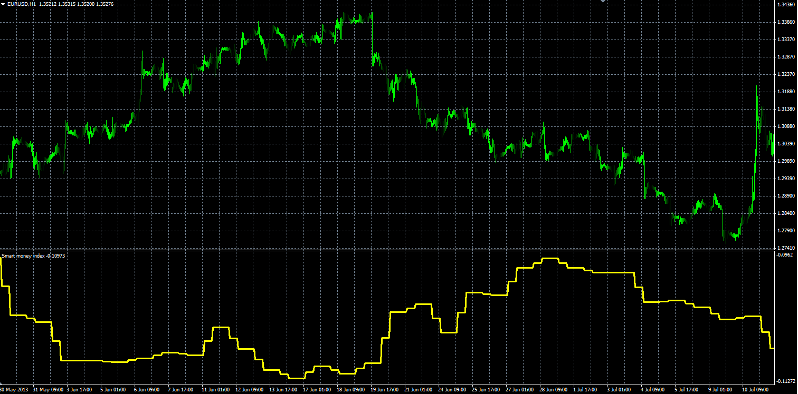

# Smart money index

> Source: https://fxcodebase.com/code/viewtopic.php?f=38&t=59585  
> Forum: 38 · Topic 59585 · 1 post(s)

---

## Smart money index

**Alexander.Gettinger** · Thu Sep 26, 2013 11:38 am

Original LUA indicator: [viewtopic.php?f=17&t=52933](https://fxcodebase.com/code/viewtopic.php?f=17&t=52933).

Formulas:
SMI[i] = SMI[i-1]-(Close(OpenHour)-Open(OpenHour))+(Close(CloseHour)-Open(CloseHour)), where
CloseHour = OpenHour+SessionLength.

 

Download:

 [Smart_Money_Index.mq4](files/89715/Smart_Money_Index.mq4)
