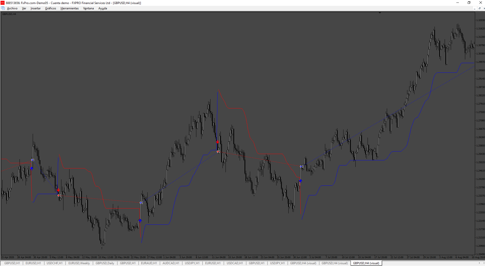

# Smart_trail_EA

> Source: https://fxcodebase.com/code/viewtopic.php?f=38&t=75286  
> Forum: 38 · Topic 75286 · 4 post(s)

---

## Smart_trail_EA

**Apprentice** · Thu Oct 17, 2024 6:15 pm

Based on the request.
[https://fxcodebase.com/code/viewtopic.p ... 59#p156759](https://fxcodebase.com/code/viewtopic.php?f=27&p=156759#p156759)

 [Smart_Trail.mq4](files/157017/Smart_Trail.mq4)

 [Smart_trail_EA.mq4](files/157017/Smart_trail_EA.mq4)

---

## Re: Smart_trail_EA

**trtrader** · Mon Nov 04, 2024 10:20 pm

Could you please add MA filter?

When EMA 50 above EMA 200 = Allow only buy
When EMA 50 below EMA 200 = Allow only sell

Please make sure EMA numbers are in EA inputs so we can change if needed.

---

## Re: Smart_trail_EA

**Apprentice** · Wed Nov 06, 2024 2:56 pm

We have added your request to the development list.
Development reference 838

---

## Re: Smart_trail_EA

**Apprentice** · Sun Nov 10, 2024 3:18 pm

 [Smart_trail_EA.mq4](files/157230/Smart_trail_EA.mq4)
