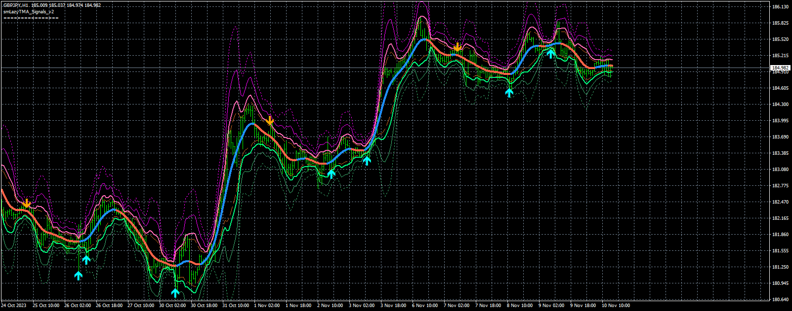

# smLazyTMA_Signals_v2

> Source: https://fxcodebase.com/code/viewtopic.php?f=38&t=75021  
> Forum: 38 · Topic 75021 · 1 post(s)

---

## smLazyTMA_Signals_v2

**Apprentice** · Wed Jul 03, 2024 11:42 am

Based on the request.
[https://fxcodebase.com/code/viewtopic.p ... 47#p155847](https://fxcodebase.com/code/viewtopic.php?f=27&p=155847#p155847)

 [smLazyTMA_Signals_v2.mq4](files/155980/smLazyTMA_Signals_v2.mq4)
