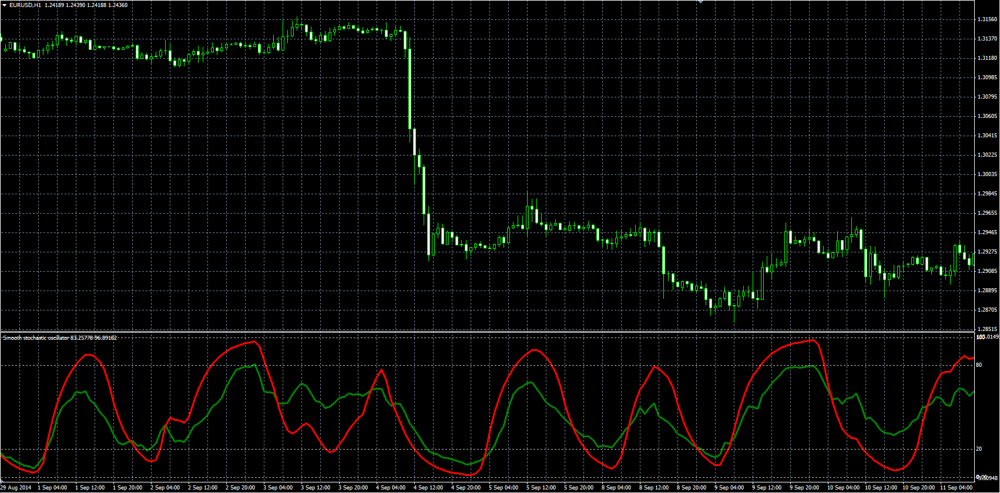

# Smooth stochastic indicator

> Source: https://fxcodebase.com/code/viewtopic.php?f=38&t=61549  
> Forum: 38 · Topic 61549 · 1 post(s)

---

## Smooth stochastic indicator

**Alexander.Gettinger** · Wed Nov 26, 2014 3:21 pm

The indicator looks like a traditional stochastic.

Formulas:
Line[i] = K*(St-Line[i-1])+Line[i-1],
Signal[i] = K2*(St2-Signal[i-1])+Signal[i-1], where
K = 2/(1+[Slowing]),
K2 = 2/(1+[SignalSlowing]),
St = 100*(close[i]-LowPrice)/(HighPrice-LowPrice),
LowPrice, HighPrice - minimum and maximum prices at range from (i-Period+1) to (i),
S2 = 100*(Line[i]-LowPrice2)/(HighPrice2-LowPrice2),
LowPrice2, HighPrice2 - minimum and maximum of Line at range from (i-Period+1) to (i).

 

Download:

 [Stochastic_Smooth.mq4](files/97395/Stochastic_Smooth.mq4)
