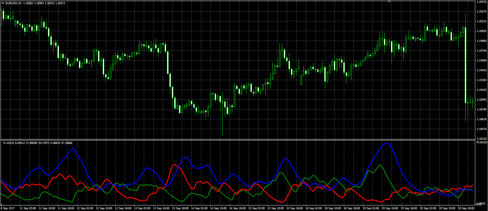

# Smoothed ADX indicator

> Source: https://fxcodebase.com/code/viewtopic.php?f=38&t=65130  
> Forum: 38 · Topic 65130 · 1 post(s)

---

## Smoothed ADX indicator

**Alexander.Gettinger** · Fri Sep 29, 2017 10:28 am

Formulas:
DIP[i]=Alpha2*DIP_Temp[i]+(1-Alpha2)*DIP[i-1],
DIM[i]=Alpha2*DIM_Temp[i]+(1-Alpha2)*DIM[i-1],
ADX[i]=Alpha2*ADX_Temp[i]+(1-Alpha2)*ADX[i-1], where
DIP_Temp[i]=2*DMI_P[i]+(Alpha1-2)*DMI_P[i-1]+(1-Alpha1)*DIP_Temp[i-1],
DIM_Temp[i]=2*DMI_M[i]+(Alpha1-2)*DMI_M[i-1]+(1-Alpha1)*DIM_Temp[i-1],
ADX_Temp[i]=2*ADX_I[i]+(Alpha1-2)*ADX_I[i-1]+(1-Alpha1)*ADX_Temp[i-1],
DMI_P, DMI_M - DMI+ and DMI-,
ADX_I - standard ADX indicator.

 

Download:

 [Smoothed_ADX.mq4](files/115162/Smoothed_ADX.mq4)
