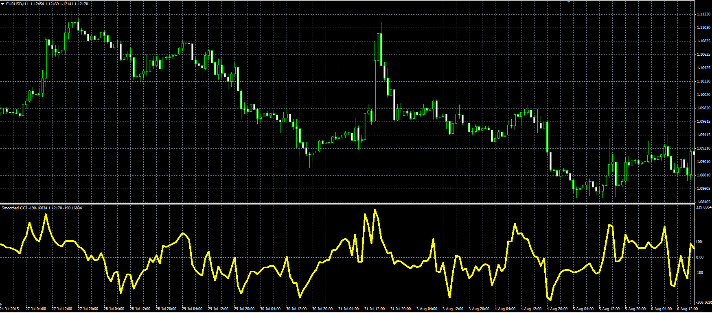

# Smoothed CCI

> Source: https://fxcodebase.com/code/viewtopic.php?f=38&t=62611  
> Forum: 38 · Topic 62611 · 6 post(s)

---

## Smoothed CCI

**Alexander.Gettinger** · Mon Aug 31, 2015 11:33 am

Original LUA oscillator: [viewtopic.php?f=17&t=62497](https://fxcodebase.com/code/viewtopic.php?f=17&t=62497).

 

Download:

 [Smoothed_CCI.mq4](files/102097/Smoothed_CCI.mq4)

---

## Re: Smoothed CCI

**pkartaaa85** · Sat Nov 13, 2021 3:11 am

Hi Apprentice
 can i get the MTF version of this smoothed CCI indicator..

---

## Re: Smoothed CCI

**Apprentice** · Mon Nov 15, 2021 4:13 am

As a dashboard or just a higher time frame oscillator version?

---

## Re: Smoothed CCI

**pkartaaa85** · Tue Nov 16, 2021 7:02 am

Hi Multi timeframe oscillator version pls.
Thanks

---

## Re: Smoothed CCI

**Apprentice** · Thu Nov 18, 2021 5:01 am

Your request is added to the development list.
Development reference 996.

---

## Re: Smoothed CCI

**Apprentice** · Wed Feb 05, 2025 3:22 pm

 [Smoothed_CCI.mq4](files/158132/Smoothed_CCI.mq4)
