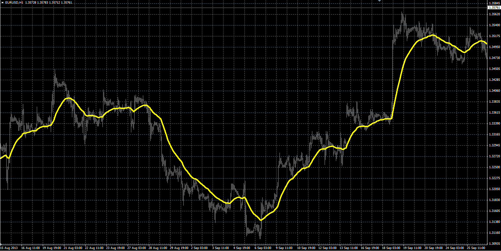

# Smoothed Moving Average

> Source: https://fxcodebase.com/code/viewtopic.php?f=38&t=59629  
> Forum: 38 · Topic 59629 · 1 post(s)

---

## Smoothed Moving Average

**Alexander.Gettinger** · Wed Oct 09, 2013 10:03 am

Formula:
SMMA[i] = (SMMA[i-1]*(Length-1)+Price[i])/Length.

 

Download:

 [SMMA.mq4](files/89911/SMMA.mq4)
