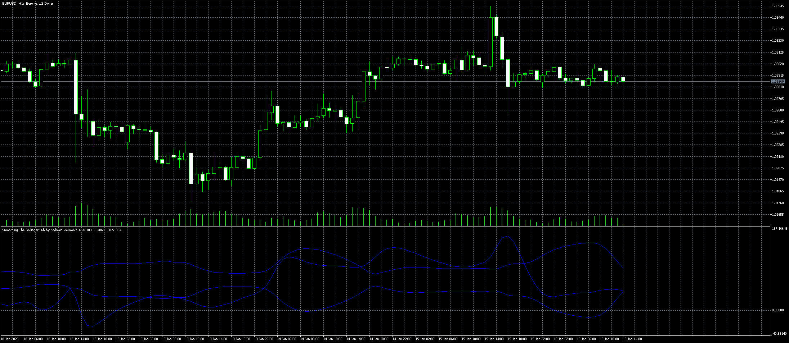

# Smoothing_The_Bollinger__b_by_Sylvain_Vervoort

> Source: https://fxcodebase.com/code/viewtopic.php?f=38&t=75514  
> Forum: 38 · Topic 75514 · 1 post(s)

---

## Smoothing_The_Bollinger__b_by_Sylvain_Vervoort

**Apprentice** · Thu Jan 16, 2025 7:09 am

TS2 version
[https://fxcodebase.com/code/viewtopic.p ... 69#p149769](https://fxcodebase.com/code/viewtopic.php?f=17&p=149769#p149769)

 [Smoothing_The_Bollinger__b_by_Sylvain_Vervoort.mq5](files/157869/Smoothing_The_Bollinger__b_by_Sylvain_Vervoort.mq5)
