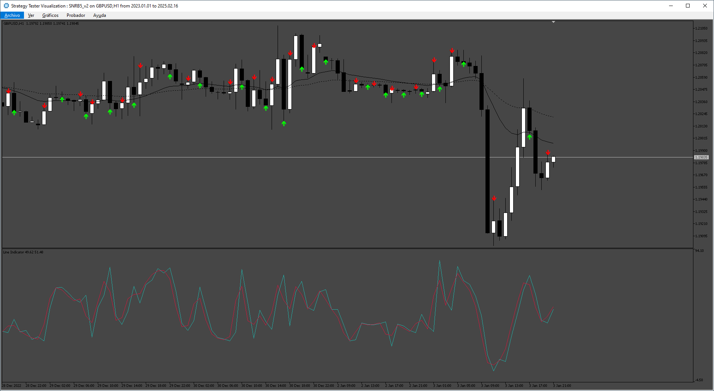

# SNRB5

> Source: https://fxcodebase.com/code/viewtopic.php?f=38&t=75762  
> Forum: 38 · Topic 75762 · 5 post(s)

---

## SNRB5

**Apprentice** · Fri Mar 28, 2025 4:13 am

Based on the request.
[https://fxcodebase.com/code/viewtopic.php?f=27&p=158697](https://fxcodebase.com/code/viewtopic.php?f=27&p=158697)

 [SNRB5_v2.mq5](files/158798/SNRB5_v2.mq5)

---

## Re: SNRB5

**Luci Lira** · Fri Mar 28, 2025 9:14 am

> **Apprentice wrote:**
>
>
> The attachment **eurusd-d1-metaquotes-ltd.png** is no longer available
>
>
> Based on the request.
> [https://fxcodebase.com/code/viewtopic.php?f=27&p=158697](https://fxcodebase.com/code/viewtopic.php?f=27&p=158697)
>
>
> The attachment **eurusd-d1-metaquotes-ltd.png** is no longer available

Only buy arrows appear in the visual tester

---

## Re: SNRB5

**Apprentice** · Mon Mar 31, 2025 3:55 am

We have added your request to the development list.
Development reference 242

---

## Re: SNRB5

**Apprentice** · Wed Apr 09, 2025 9:31 am

 [SNRB5_v2.ex5](files/158910/SNRB5_v2.ex5)

---

## Re: SNRB5

**Apprentice** · Wed Apr 16, 2025 2:25 am

 [SNRB5_v3.ex5](files/158964/SNRB5_v3.ex5)

 [SNRB5_v3_EA_v1.00.mq5](files/158964/SNRB5_v3_EA_v1.00.mq5)
