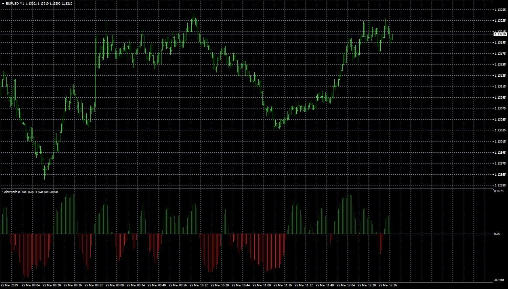

# Solar Winds

> Source: https://fxcodebase.com/code/viewtopic.php?f=38&t=68169  
> Forum: 38 · Topic 68169 · 1 post(s)

---

## Solar Winds

**Apprentice** · Mon Mar 25, 2019 9:45 am

Based on TS2/JavaScript
[viewtopic.php?f=48&t=65589](https://fxcodebase.com/code/viewtopic.php?f=48&t=65589)

SW[i]=(ln((1+Value[i])/(1-Value[i]))+SW[i-1])/2, where
ln - natural logarithm,
Value[i]=(((Median price[i] - MinP)/(MaxP-MinP)-0.5)+Value[i-1])*2/3,
MinP, MaxP - minimum and maximum prices in the range from (i-Period) to i.

 [SolarWinds.mq4](files/125308/SolarWinds.mq4)
