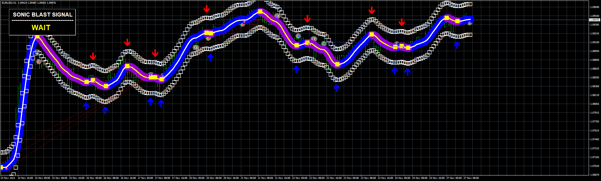

# Sonic_Blast_EA

> Source: https://fxcodebase.com/code/viewtopic.php?f=38&t=74374  
> Forum: 38 · Topic 74374 · 2 post(s)

---

## Sonic_Blast_EA

**Apprentice** · Mon Nov 27, 2023 4:17 am

 [SonicBlast.ex4](files/153419/SonicBlast.ex4)

 [Sonic_Blast_EA._v1.11.mq4](files/153419/Sonic_Blast_EA._v1.11.mq4)

---

## Re: Sonic_Blast_EA

**Apprentice** · Thu Dec 07, 2023 2:50 pm

For users: The indicator is repainting and delaying so I made with different method which contain “Check Signal” setting (I’ve attached an image). With this setting the EA check the previous candles for indicator signal and it can detect if indicator is repainting or delaying. The EA is much more accurate but not 100% because of the indicator.

 [Sonic_Blast_EA._v1.2.mq4](files/153606/Sonic_Blast_EA._v1.2.mq4)
