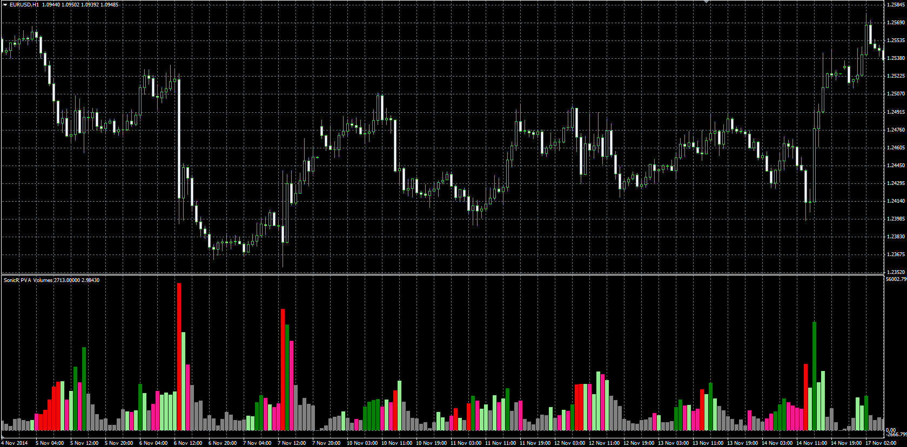

# SonicR PVA Volumes

> Source: https://fxcodebase.com/code/viewtopic.php?f=38&t=62087  
> Forum: 38 · Topic 62087 · 3 post(s)

---

## SonicR PVA Volumes

**Alexander.Gettinger** · Wed Apr 08, 2015 11:25 am

Original LUA indicator: [viewtopic.php?f=17&t=60177](https://fxcodebase.com/code/viewtopic.php?f=17&t=60177).

 

Download:

 [PVA.mq4](files/99682/PVA.mq4)

---

## Re: SonicR PVA Volumes

**tmue2014** · Wed Apr 08, 2015 8:55 pm

your time permitting - would like to re-post my request to also code the PVA Overlay with Alert for MT4 which would paint Candles based on PVA indication.

[viewtopic.php?f=17&t=60177#p91839](https://fxcodebase.com/code/viewtopic.php?f=17&t=60177#p91839)

Thanks a lot in advance for your time & consideration

---

## Re: SonicR PVA Volumes

**Apprentice** · Sun Apr 12, 2015 6:27 am

Your request is added to the development list.
