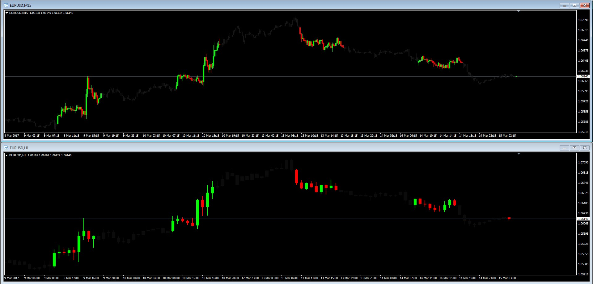

# Specific Time Range Candles

> Source: https://fxcodebase.com/code/viewtopic.php?f=38&t=64526  
> Forum: 38 · Topic 64526 · 1 post(s)

---

## Specific Time Range Candles

**Apprentice** · Wed Mar 15, 2017 6:00 am

LUA Original: [viewtopic.php?f=17&t=5172](https://fxcodebase.com/code/viewtopic.php?f=17&t=5172)

Description:

This is a candle color overlay based on specific hours of the day. For example a trader would like to see only the candles taking place in one session or busy hours like London Open to London Close. In the picture the same settings of Start Hour and Number of Hours have been set in the H1 chart and the M15.

It also has the feature to turn the current candle on and off (to color it regardles it belongs to the selected time window).

Note: The trader needs to make the bar and candle colors to none (or nearly invisible) in the chart properties window (F8)

 [Specific_Time_Range_Candles.mq4](files/111464/Specific_Time_Range_Candles.mq4)
