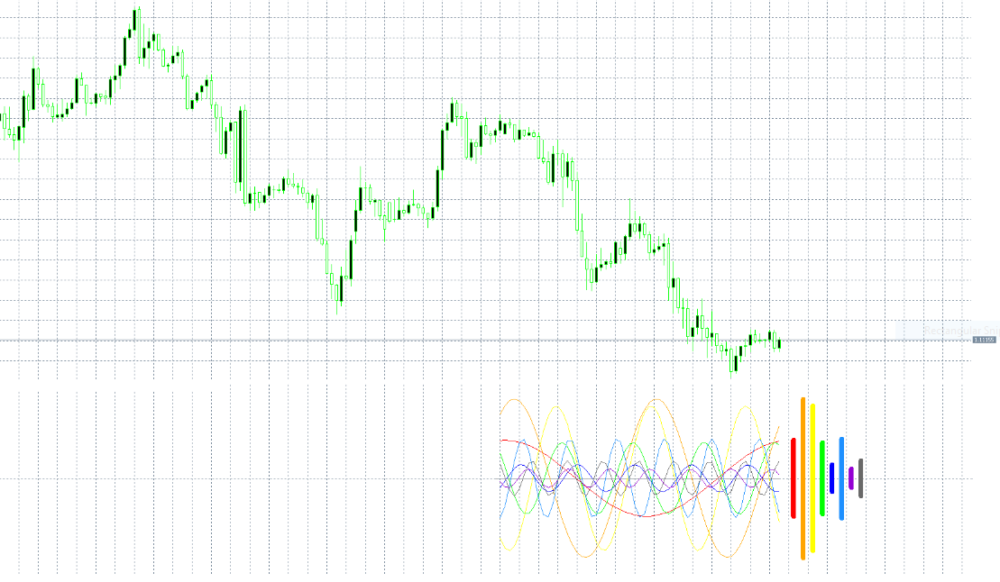

# Spectrometer separate indicator

> Source: https://fxcodebase.com/code/viewtopic.php?f=38&t=69942  
> Forum: 38 · Topic 69942 · 1 post(s)

---

## Spectrometer separate indicator

**Apprentice** · Sun May 31, 2020 4:08 am

Based on the TS2/Lua version.
[viewtopic.php?f=17&t=31129](https://fxcodebase.com/code/viewtopic.php?f=17&t=31129)

 [Spectrometer_Indicator.mq5](files/134461/Spectrometer_Indicator.mq5)
