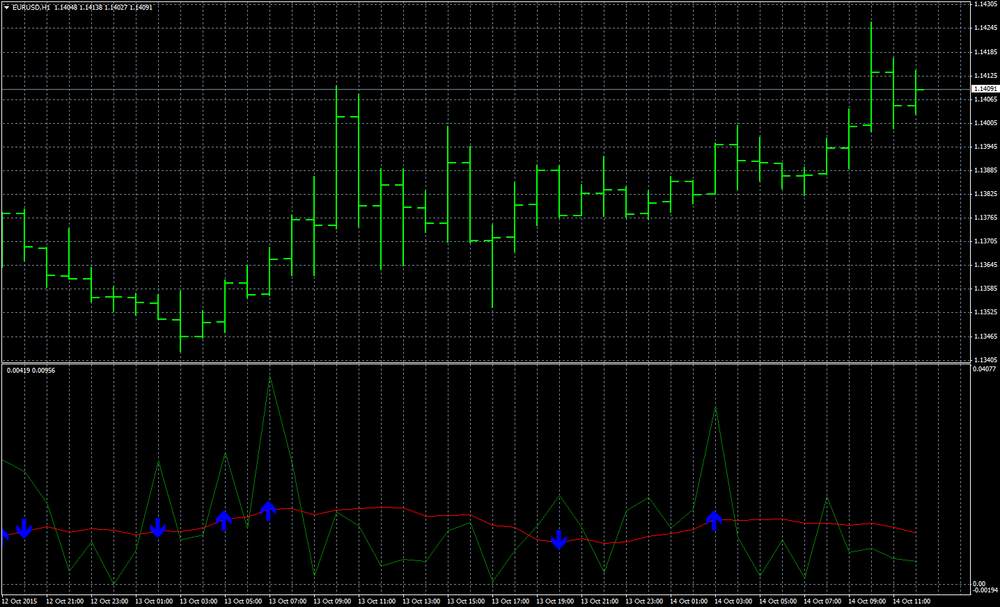

# Speed of Trade

> Source: https://fxcodebase.com/code/viewtopic.php?f=38&t=62785  
> Forum: 38 · Topic 62785 · 7 post(s)

---

## Speed of Trade

**Apprentice** · Wed Oct 14, 2015 5:20 am

Based on request.
[viewtopic.php?f=27&t=25492](https://fxcodebase.com/code/viewtopic.php?f=27&t=25492)

 [SoT.mq4](files/102829/SoT.mq4)

 [SoT with Alert.mq4](files/102829/SoT%20with%20Alert.mq4)

MT5 Version.
[https://fxcodebase.com/code/viewtopic.php?f=38&t=70032](https://fxcodebase.com/code/viewtopic.php?f=38&t=70032)

---

## Re: Speed of Trade

**miafx666** · Sat Dec 19, 2015 10:47 am

Hi Apprentice, could you make an autotrading EA for this indi, it seems pretty accurate on some timeframes. It could be used for forex and Binary Options as well i think.

---

## Re: Speed of Trade

**Apprentice** · Mon Dec 21, 2015 6:08 am

Your request is added to the development list.

---

## Re: Speed of Trade

**Itssiisi** · Wed Jun 29, 2016 3:02 pm

Hello Apprentice

I am new here and I would like to know if alerts can be added to the SoT indicator and I would like to know if it predicts the direction of the next candlestick before it is formed. Thanks

---

## Re: Speed of Trade

**Apprentice** · Sun Jul 03, 2016 7:58 am

Your request is added to the development list,
Under Bugzilla Id Number 3555

Bugzilla is developer internal requests database.
If someone is interested to do any task from this list please contact me.

---

## Re: Speed of Trade

**Munkhtur** · Thu Sep 07, 2017 10:42 am

> **Apprentice wrote:**
>
>
> EURUSDH1.png
>
>
> Based on request.
> [viewtopic.php?f=27&t=25492](https://fxcodebase.com/code/viewtopic.php?f=27&t=25492)
>
>
> SoT.mq4

Hello how is this work? I tried to follow rules and ideas.
Then I checked the signals(arrows) on the MT4(EUR/USD 1MTF) for 3hours chart. But last 11/19 signals was OTM. And 6 ITM 2 doji (Next candle of arrow candle). And MT4 signals are different from Trading station signals.
Is there any good trading time or Pairs?? I checked about 2 hours ago. It means London Session.

---

## Re: Speed of Trade

**Apprentice** · Mon Jan 07, 2019 5:33 pm

SoT with Alert.mq4 added.
