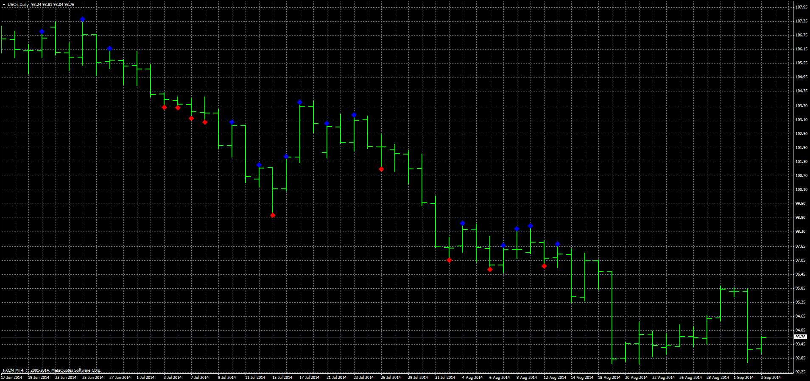

# Speed of trade

> Source: https://fxcodebase.com/code/viewtopic.php?f=38&t=61096  
> Forum: 38 · Topic 61096 · 2 post(s)

---

## Speed of trade

**Apprentice** · Wed Sep 03, 2014 4:05 am

Based on the request.
[viewtopic.php?f=27&t=61092](https://fxcodebase.com/code/viewtopic.php?f=27&t=61092)

If SOD> Average SOD * Multiplier then
Next candle will keep the direction of the current candle.

 [Speed of trade.mq4](files/95675/Speed%20of%20trade.mq4)

---

## Re: Speed of trade

**alishus** · Wed Sep 03, 2014 4:05 pm

thank you so much for your time and help to explain,very appereciate.
regards
