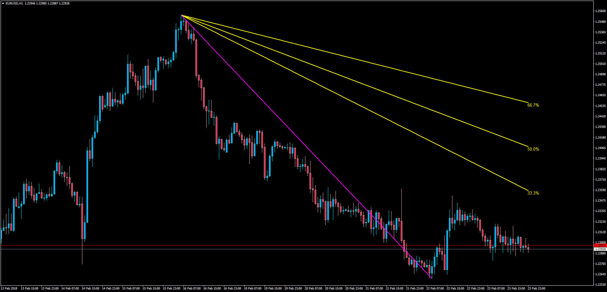
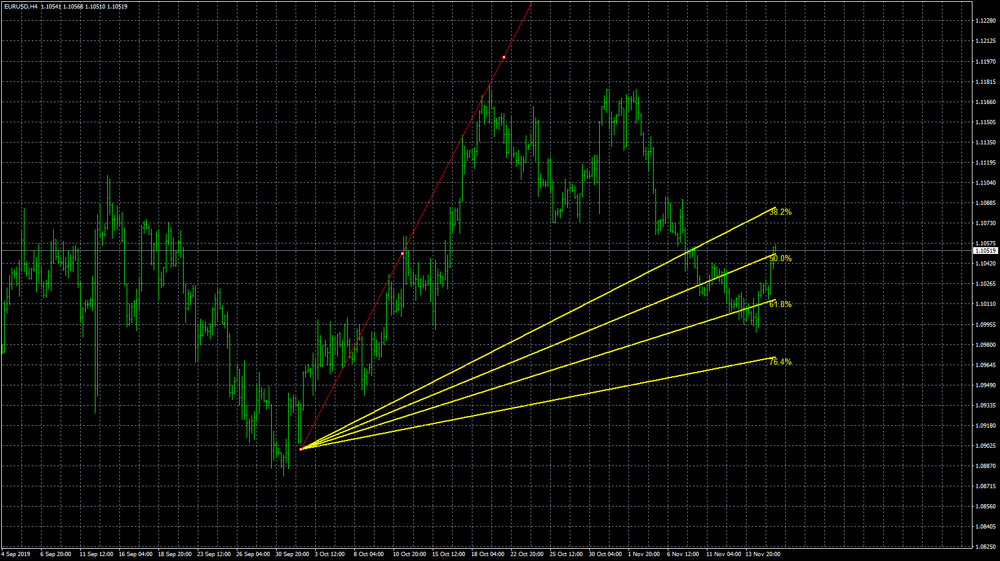

# Speedlines

> Source: https://fxcodebase.com/code/viewtopic.php?f=38&t=65770  
> Forum: 38 · Topic 65770 · 5 post(s)

---

## Speedlines

**Apprentice** · Mon Feb 26, 2018 4:30 pm

LUA Original:

Description: [viewtopic.php?f=17&t=2783](https://fxcodebase.com/code/viewtopic.php?f=17&t=2783)

This is the MT4 version of the LUA original indicator "speedlines". Speed resistance lines are a fan similar to the Fibonacci fan. However, rather than using Fibonacci numbers, the fan uses calculations by thirds.

Draw a Trend Line object from the minimum and maximum points of an identifiable trend to create the reference line. Three other lines are drawn fanning out from this line at angles of 33.33%, 50.0% and 66.66%. These lines represent lines of possible price support on retracement. They may give insight not only to the degree of retracement but also the rate of retracement (hence the term "speed lines").

 [Speedlines.mq4](files/117911/Speedlines.mq4)

---

## Re: Speedlines

**jelogui83** · Wed Nov 13, 2019 5:02 pm

yes, and how modify these 3 lines, to make them 4 and fit with 0,382 ; 0,5 ; 0,618 ; 0,764 retracement of Fibo ?
thanks a lot Apprentice.

---

## Re: Speedlines

**jelogui83** · Thu Nov 14, 2019 9:59 am

thank you for this Apprentice and sorry to follow my idea, but could you develop the real one with these 4 different Fibo retracements for MT4 ?
kind regards.

---

## Re: Speedlines

**Apprentice** · Thu Nov 14, 2019 12:00 pm

Your request is added to the development list.
Development reference 315.

---

## Re: Speedlines

**Apprentice** · Mon Nov 18, 2019 7:17 am

The indicator will draw fan retracement lines from a manually drawn trend line
You must draw a trend line from a recognizable high and low
Then on its properties rename this trend line to 'speedline' or the one you define in the windows properties.

 [Speedlines.mq4](files/129817/Speedlines.mq4)
