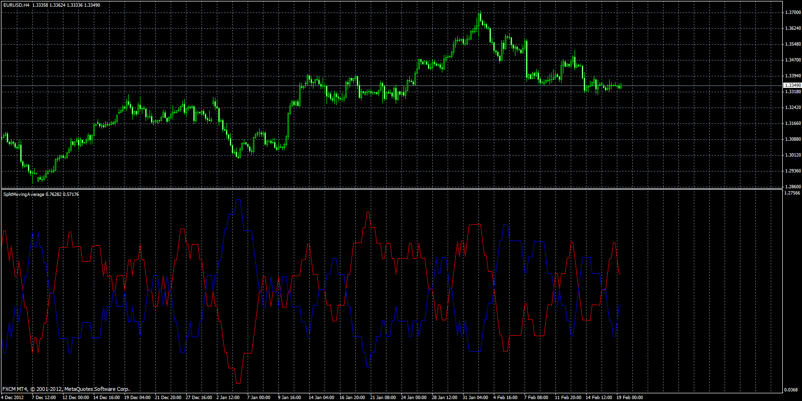

# Split Moving Average

> Source: https://fxcodebase.com/code/viewtopic.php?f=38&t=59612  
> Forum: 38 · Topic 59612 · 1 post(s)

---

## Split Moving Average

**Apprentice** · Sat Oct 05, 2013 3:58 am

 [Split Moving Average.mq4](files/89847/Split%20Moving%20Average.mq4)

 [Split Moving Average of Volume.mq4](files/89847/Split%20Moving%20Average%20of%20Volume.mq4)
