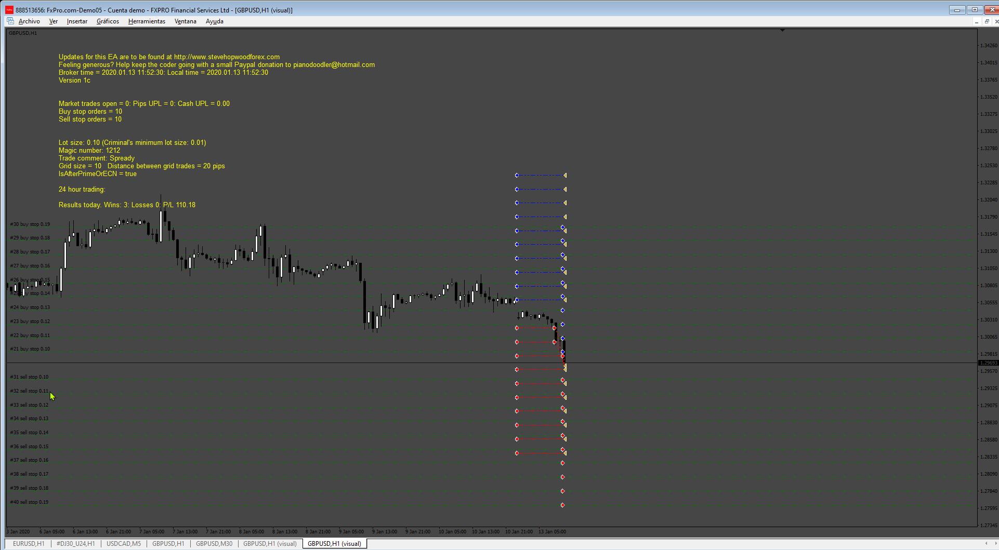
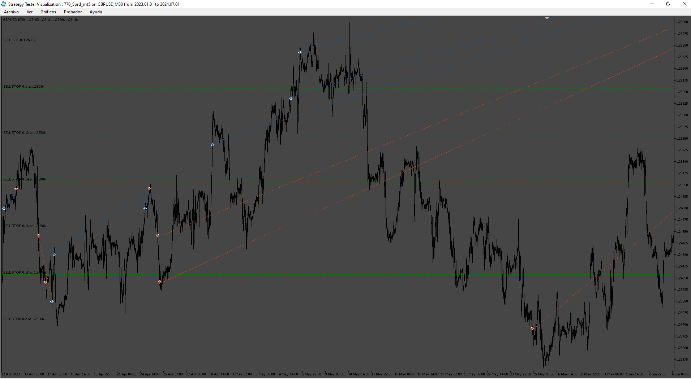

# Sprd_v2

> Source: https://fxcodebase.com/code/viewtopic.php?f=38&t=75127  
> Forum: 38 · Topic 75127 · 5 post(s)

---

## Sprd_v2

**Apprentice** · Sat Aug 10, 2024 8:13 pm

Based on the request.
[https://fxcodebase.com/code/viewtopic.p ... 95#p156195](https://fxcodebase.com/code/viewtopic.php?f=27&p=156195#p156195)

 [Sprd_v2.mq4](files/156393/Sprd_v2.mq4)

---

## Re: Sprd_v2

**fiox89** · Wed Oct 09, 2024 3:03 am

Hello. It's possibile to convert this EA to run in metatrader 5? Thanks!

---

## Re: Sprd_v2

**Apprentice** · Wed Oct 09, 2024 12:24 pm

We have added your request to the development list.
Development reference 770

---

## Re: Sprd_v2

**trtrader** · Thu Oct 10, 2024 8:23 am

Could you please add the attached indicator to this EA's MT4 version as a filter?

Open only buy orders if filter green and sell orders only if filter red.

---

## Re: Sprd_v2

**Apprentice** · Sun Nov 24, 2024 5:34 am

 [Sprd_mt5 EA.mq5](files/157340/Sprd_mt5%20EA.mq5)
