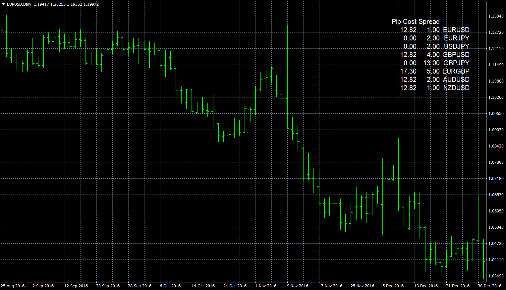
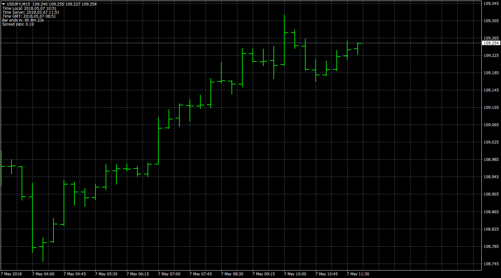

# Spread List

> Source: https://fxcodebase.com/code/viewtopic.php?f=38&t=65492  
> Forum: 38 · Topic 65492 · 4 post(s)

---

## Spread List

**Apprentice** · Sun Dec 31, 2017 5:37 am

 [Spread list.mq4](files/116682/Spread%20list.mq4)

Lua version: [viewtopic.php?f=17&t=8525](https://fxcodebase.com/code/viewtopic.php?f=17&t=8525)

 

 [time_and_spread.mq4](files/116682/time_and_spread.mq4)

---

## Re: Spread List

**seunboi4u** · Sun Apr 29, 2018 10:52 am

yes i still respect you all there for the indicators you guys are building for free God bless you all but can you include this to the indicators see the pictures below thanks

---

## Re: Spread List

**Apprentice** · Mon Apr 30, 2018 4:04 pm

Your request is added to the development list under Id Number 4127

---

## Re: Spread List

**Apprentice** · Mon May 07, 2018 5:53 am

time_and_spread.mq4 added.
