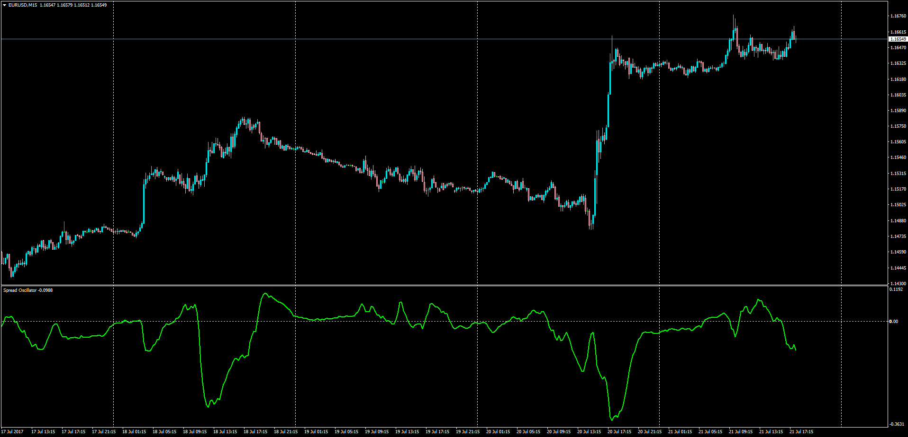

# Spread Oscillator

> Source: https://fxcodebase.com/code/viewtopic.php?f=38&t=64942  
> Forum: 38 · Topic 64942 · 1 post(s)

---

## Spread Oscillator

**Apprentice** · Sat Jul 22, 2017 8:37 am

LUA Original: [viewtopic.php?f=17&t=36328](https://fxcodebase.com/code/viewtopic.php?f=17&t=36328)

Description:

This is the MT4 version of the LUA Original oscillator that shows the spread between two instruments.

Ratio = (First Instrument / Second Instrument)*100

Spread Oscillator = Long MA of Ratio - Short MA of Ratio

 [Spread_Oscillator.mq4](files/113699/Spread_Oscillator.mq4)
