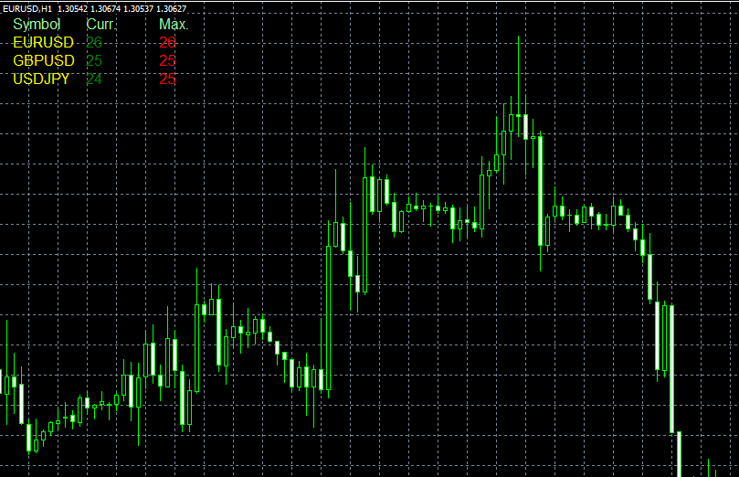

# Spreads script

> Source: https://fxcodebase.com/code/viewtopic.php?f=38&t=32555  
> Forum: 38 · Topic 32555 · 1 post(s)

---

## Spreads script

**Alexander.Gettinger** · Thu Feb 28, 2013 5:54 pm

The script shows the spreads (current and maximum) on all instruments (from market watch) at different timeframes.

 

Download:

 [Spreads.mq4](files/55452/Spreads.mq4)
