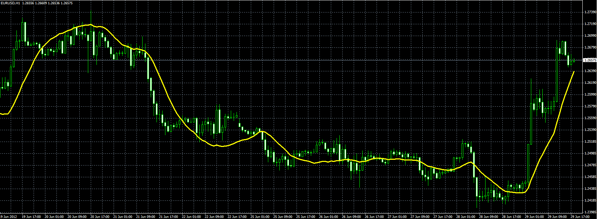

# Square weighted MA

> Source: https://fxcodebase.com/code/viewtopic.php?f=38&t=20680  
> Forum: 38 · Topic 20680 · 1 post(s)

---

## Square weighted MA

**Alexander.Gettinger** · Fri Jun 29, 2012 1:44 pm

Original indicator: [viewtopic.php?f=17&t=3697](https://fxcodebase.com/code/viewtopic.php?f=17&t=3697)

Formulas:
MA=(Sum-SumP*(SumW*Period-SumP*Sum)/(SumP2*Period-SumP*SumP))/Period, where
Sum[i]=Price[i]+Price[i-1]+...+Price[i-Period+1],
SumW[i]=Price[i-1]*1+Price[i-2]*2+...+Price[i-Period+1]*(Period-1),
SumP=1+2+...+(Period-1),
SumP2=1*1+2*2+...+(Period-1)*(Period-1).

 

Download:

 [SqW_MA.mq4](files/36261/SqW_MA.mq4)
