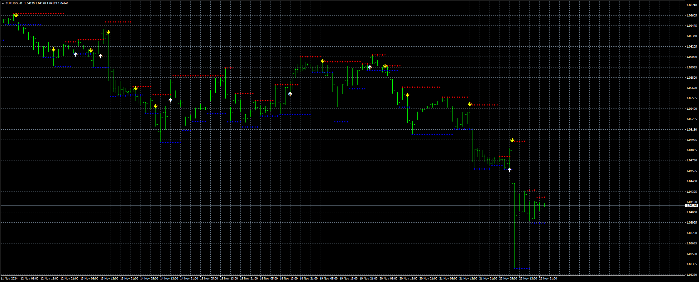

# SR_Breakout_Arrows_MTF

> Source: https://fxcodebase.com/code/viewtopic.php?f=38&t=75369  
> Forum: 38 · Topic 75369 · 5 post(s)

---

## SR_Breakout_Arrows_MTF

**Apprentice** · Sun Nov 24, 2024 5:14 am

Based on the request.
[https://fxcodebase.com/code/viewtopic.php?f=17&t=75344](https://fxcodebase.com/code/viewtopic.php?f=17&t=75344)

 [SR_Breakout_Arrows_MTF.mq4](files/157333/SR_Breakout_Arrows_MTF.mq4)

---

## Re: SR_Breakout_Arrows_MTF

**aarkay** · Sun Nov 24, 2024 11:52 pm

Thank you sooo much Apprentice .

I am definitely going to contribute.

---

## Re: SR_Breakout_Arrows_MTF

**alema0** · Wed Nov 27, 2024 9:11 am

There is a way to convert this indicator with the buffers to mt5. Thanks

---

## Re: SR_Breakout_Arrows_MTF

**Apprentice** · Wed Nov 27, 2024 2:39 pm

We have added your request to the development list.
Development reference 874

---

## Re: SR_Breakout_Arrows_MTF

**Apprentice** · Wed Apr 23, 2025 3:50 am

 [SR_Breakout_Arrows_MTF.mq5](files/159016/SR_Breakout_Arrows_MTF.mq5)
