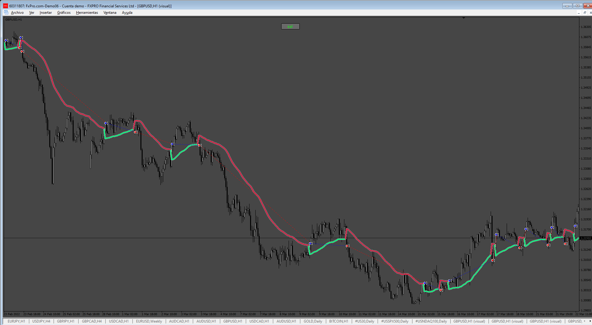

# SSL_Average_EA

> Source: https://fxcodebase.com/code/viewtopic.php?f=38&t=75676  
> Forum: 38 · Topic 75676 · 2 post(s)

---

## SSL_Average_EA

**Apprentice** · Thu Mar 06, 2025 3:20 pm

Based on the request.
[https://fxcodebase.com/code/viewtopic.p ... 57#p158457](https://fxcodebase.com/code/viewtopic.php?f=27&p=158457#p158457)

 [SSL (eAverages).ex4](files/158504/SSL%20%28eAverages%29.ex4)

 [SSL_Average_EA.mq4](files/158504/SSL_Average_EA.mq4)

---

## Re: SSL_Average_EA

**mahi kahn** · Tue Mar 11, 2025 2:01 pm

my dear friend pleas add indicator sitting
