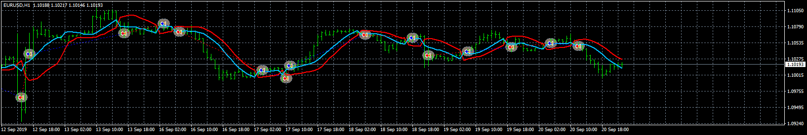
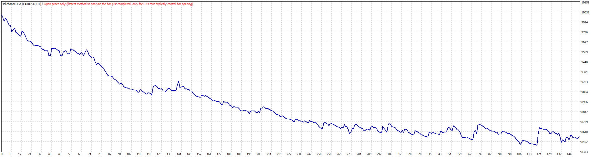
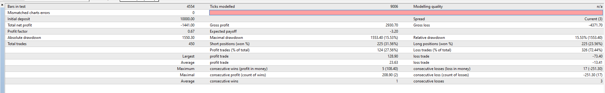
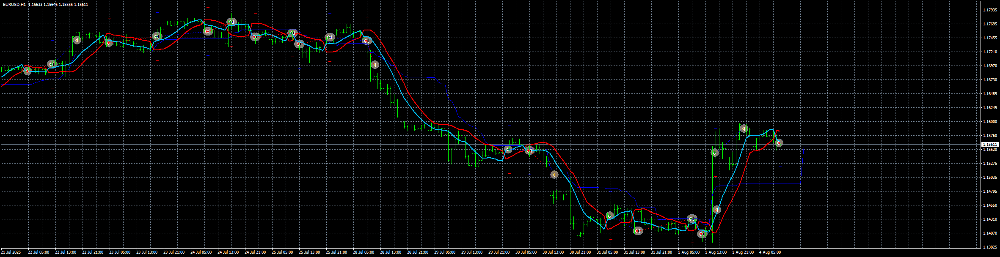

# ssl-channel-EA

> Source: https://fxcodebase.com/code/viewtopic.php?f=38&t=69212  
> Forum: 38 · Topic 69212 · 10 post(s)

---

## ssl-channel-EA

**Apprentice** · Mon Dec 09, 2019 8:49 am

 

 

Based on request.
[viewtopic.php?f=27&t=69201](https://fxcodebase.com/code/viewtopic.php?f=27&t=69201)

 [ssl-channel-chart-alert-indicator.mq4](files/130153/ssl-channel-chart-alert-indicator.mq4)

 [ssl-channel-EA.mq4](files/130153/ssl-channel-EA.mq4)

---

## Re: ssl-channel-EA

**cryptoconvert** · Mon Dec 09, 2019 3:41 pm

Thank you very much. I possibly will need on only use it to close positions, the backtesting looks less proming than I hoped. Much more testing necessary, will feedback here.

Thanks again!

---

## Re: ssl-channel-EA

**paymanz** · Wed Jun 10, 2020 4:11 am

its interesting EA with good options. i want ask a question: whats the trigger for opening a position? also do you develop it on mt5?

thanks!

---

## Re: ssl-channel-EA

**Apprentice** · Wed Jun 10, 2020 5:07 am

Your request is added to the development list.
Development reference 1454.

---

## Re: ssl-channel-EA

**Apprentice** · Wed Jun 17, 2020 6:42 am

[ssl-channel-chart-indicator.mq5](files/135030/ssl-channel-chart-indicator.mq5)

 [ssl-channel-EA.mq5](files/135030/ssl-channel-EA.mq5)

MT5/MQ5 versions.

---

## Re: ssl-channel-EA

**DVengeance** · Thu Aug 18, 2022 8:02 pm

Hi,

Both versions seem to have some bugs, could you please review.

The MT4 version does not respect the start and end time frame input so it holds positions open after I have set a mandatory close at 215500 for example - see attached.

The MT5 version does not work properly - opens both buy and sell at the same time and does not respect the mandatory close and start - end time.

P.S. I would love to have a Kijun-sen MA additional filter for the entries - SSL only acts Direct/Reversal if above/below MA.

Thanks

---

## Re: ssl-channel-EA

**Apprentice** · Fri Aug 19, 2022 4:35 am

We have added your request to the development list.
Development reference 499.

---

## Re: ssl-channel-EA

**DVengeance** · Wed Jan 25, 2023 6:41 am

Sorry to ask again, but was this request scrapped?

---

## Re: ssl-channel-EA

**Apprentice** · Thu Jan 26, 2023 5:53 am

Is not, one of the developers needs to take on the task.

---

## Re: ssl-channel-EA

**Apprentice** · Mon Aug 04, 2025 3:19 am

 [ssl-channel-chart-alert-indicator.mq4](files/160108/ssl-channel-chart-alert-indicator.mq4)

 [kijun-sen.mq4](files/160108/kijun-sen.mq4)

 [ssl-channel_EA_v1.10.mq4](files/160108/ssl-channel_EA_v1.10.mq4)

 [ssl-channel-chart-indicator.mq5](files/160108/ssl-channel-chart-indicator.mq5)

 [Kijun-Sen_alerts_MT5.mq5](files/160108/Kijun-Sen_alerts_MT5.mq5)

 [ssl-channel_EA_v1.10.mq5](files/160108/ssl-channel_EA_v1.10.mq5)
