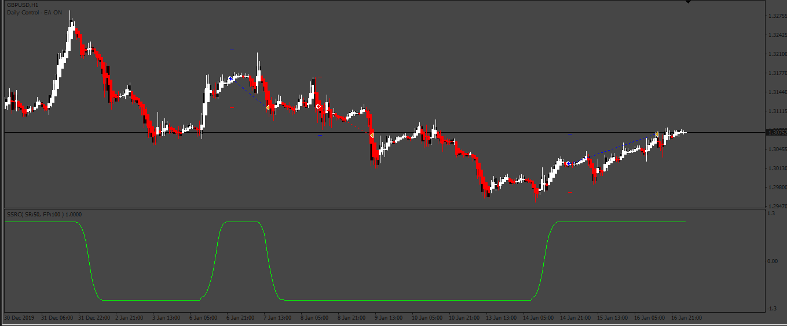
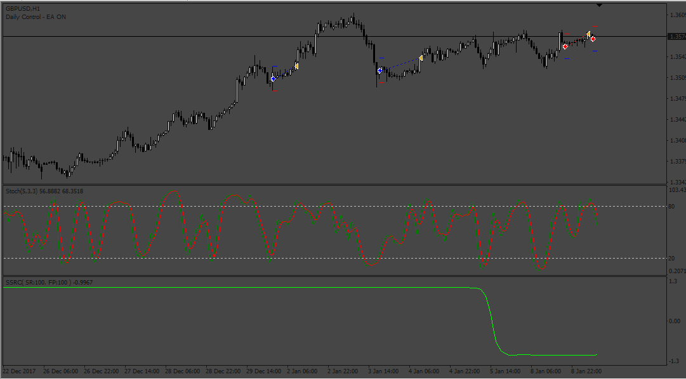
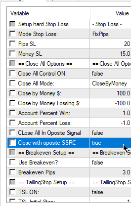
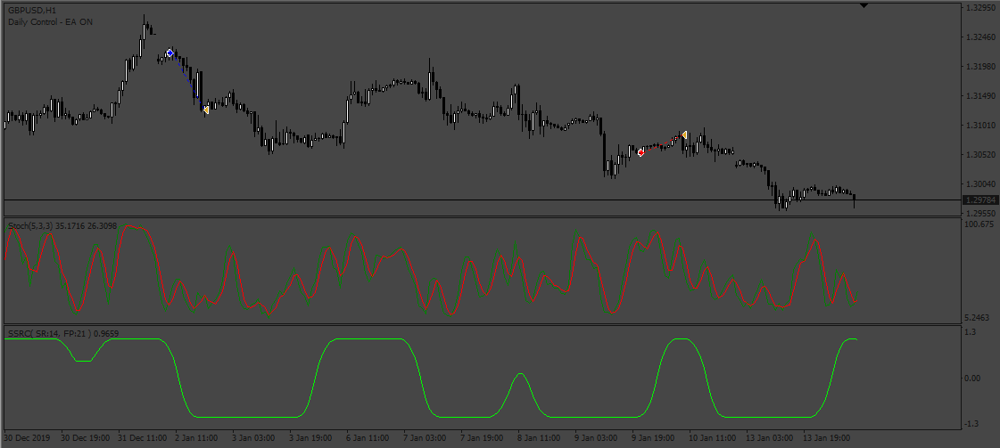
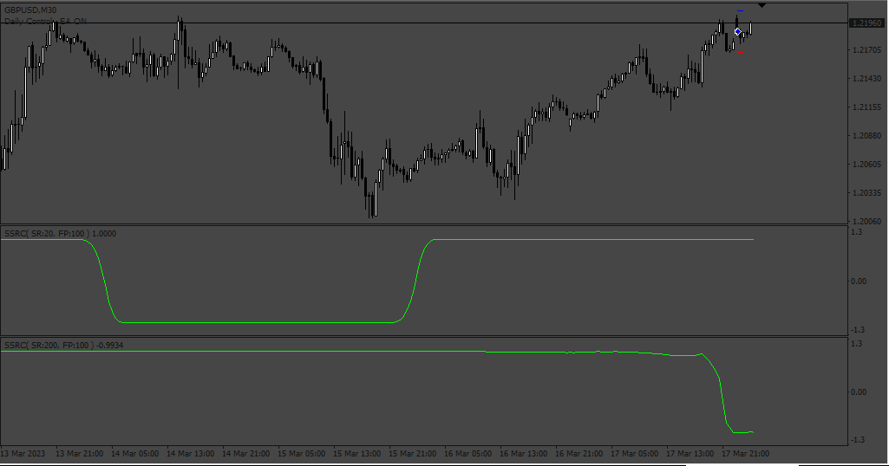

# SSRC EA

> Source: https://fxcodebase.com/code/viewtopic.php?f=38&t=71812  
> Forum: 38 · Topic 71812 · 18 post(s)

---

## SSRC EA

**Apprentice** · Mon Jan 24, 2022 6:27 am

Based on the request.
[https://fxcodebase.com/code/viewtopic.php?f=27&p=144757](https://fxcodebase.com/code/viewtopic.php?f=27&p=144757)

 [ssrc.mq4](files/144819/ssrc.mq4)

 [SSRC EA.mq4](files/144819/SSRC%20EA.mq4)

---

## Re: SSRC EA

**blackworldpremium** · Wed Jan 26, 2022 8:55 am

hi admin want request some modification

this strategy using ssrc indicator and stoch indicator

condition buy:
when ssrc at level 1 it show uptrend and to entry buy stoch must cross at Oversold level like 20 or 10

condition sell:
when ssc at level -1 it show downtrend and to entry sell stoch must cross at Overbought level like 80 or 90

thanks again admin for the help

---

## Re: SSRC EA

**Apprentice** · Mon Jan 31, 2022 5:02 am

Your request is added to the development list.
Development reference 73.

---

## Re: SSRC EA

**blackworldpremium** · Tue Feb 01, 2022 5:30 am

thanks admin

---

## Re: SSRC EA

**blackworldpremium** · Thu Feb 03, 2022 5:12 pm

hi admin sorry for distrub u again

want ur help

can you help me change sop entry using this ssrc

before this if buy ssrc must cross -0.75 right so i just want to change if cross level 0.75 or any positive number it will take buy entry. for sell before this cross 0.75 so will change to -0.75 or negetive number.

also can you remove heikin ashi too.

thanks again admin

---

## Re: SSRC EA

**Apprentice** · Tue Feb 15, 2022 2:42 pm

Try this version.

 [SSRC EA.mq4](files/145047/SSRC%20EA.mq4)

---

## Re: SSRC EA

**blackworldpremium** · Wed Feb 16, 2022 4:40 am

thanks admin for hardwork

just want make last modification.

can you make new sop using ssrc.

it simple sop.

buy condition when ssrc cross positif level that we set and close when opposite signal appear
sell condition when ssrc cross negetif level that we set and close when opposite signal appear

thanks again admin

---

## Re: SSRC EA

**Apprentice** · Wed Feb 16, 2022 7:39 am

Your request is added to the development list.
Development reference 103.

---

## Re: SSRC EA

**blackworldpremium** · Wed Feb 16, 2022 8:52 pm

hi admin
just want confirm for ssrc stoch ea for close opposite signal it is based on ssrc or stoch

thanks admin

---

## Re: SSRC EA

**Apprentice** · Fri Feb 18, 2022 5:58 am

 

 [SSRC_EA.mq4](files/145083/SSRC_EA.mq4)

---

## Re: SSRC EA

**blackworldpremium** · Fri Feb 18, 2022 7:02 am

sorry again admin can you make close by opposite signal using stoch only

thanks again admin

---

## Re: SSRC EA

**blackworldpremium** · Fri Feb 25, 2022 9:16 pm

> **blackworldpremium wrote:**
> sorry again admin can you make close by opposite signal using stoch only
>
> thanks again admin

hi admin any update for this?
thanks

---

## Re: SSRC EA

**derix3** · Mon Sep 19, 2022 8:30 am

Hi Admin

please I would like to request some modifications to this EA

For the slow and fast ssrc version if you could remove heikin ashi so that only the slow and fast ssrc indicators will be used.

For buy conditions it should be when fast ssrc cross above specified level and slow ssrc is already above specified level.

For sell conditions it should be when fast ssrc cross below specified level and slow ssrc is already below specified level.

If you could also modify it so that for closing trade on opposite signal it will use slow ssrc.

For the ssrc stoch version if you could remove stoch so that only ssrc indicator is used.

---

## Re: SSRC EA

**Apprentice** · Tue Sep 20, 2022 3:33 am

We have added your request to the development list.
Development reference 565.

---

## Re: SSRC EA

**Apprentice** · Fri Sep 23, 2022 10:03 am

[SSRC_stoch_EA.mq4](files/147545/SSRC_stoch_EA.mq4)

 [SSRC_heinken_EA.mq4](files/147545/SSRC_heinken_EA.mq4)

Try this version.

---

## Re: SSRC EA

**derix3** · Fri Sep 23, 2022 10:41 am

Thanks Apprentice.

Please if possible could you convert the EA and the SSRC indicator to MT5.

---

## Re: SSRC EA

**Apprentice** · Mon Sep 26, 2022 3:17 am

We have added your request to the development list.
Development reference 581.

---

## Re: SSRC EA

**Apprentice** · Wed Jul 19, 2023 1:45 pm

 [SSRC_heinken_EA.mq4](files/151699/SSRC_heinken_EA.mq4)
